# Learning by Doing | Jenkins Setup

## Introduction
In this section we will learn how to work with freestyle jenkins jobs.

## References
* https://www.tutorialspoint.com/jenkins/index.htm

## Assignments
### Must Do
* Create a freestyle job to print "Hello world".

```
open new item
Enter the name of project
select free style
press ok
Enter Description
In Build Select Execute shell
Enter the following line
echo "Hello World"
Save

```
* Create a freestyle job to which take absolute path of a directory then
    * List all files and directories inside that.
    * Print a message "drectory not exist" if directory doesn't exist on file system
    * Print "Inappropriate permissions" if you don't have permissions to list files.

```
open new item
Enter the name of project
select free style
press ok
select "This project is parameterized"
select string parameter 
enter Name and Default value
In build select Execute shell
Enter the following lines

#!/bin/bash
localpath=$1
if ! [ -d $localpath ]
then
	echo "Directory not found"
else
	ls $localpath &2> /dev/null
	if [ $? -eq 0 ]
        then
		echo "Permission Denied"
        fi
 fi

 save the changes


```
* Update the previously created freestyle job to only retain last 10 build history but not beyond 2 days.

```
select your project
select configure from side menu
check discard old builds
Days to keep [2]
Max # of builds to keep [10]
save the changes

```

* Clone the code available in the same repository.
    * Using git protocol

```

    Enter your git credentials
```
    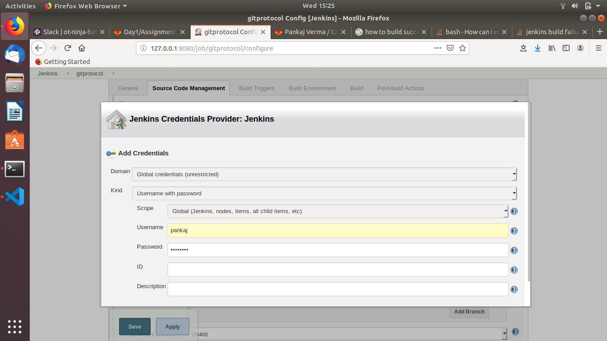

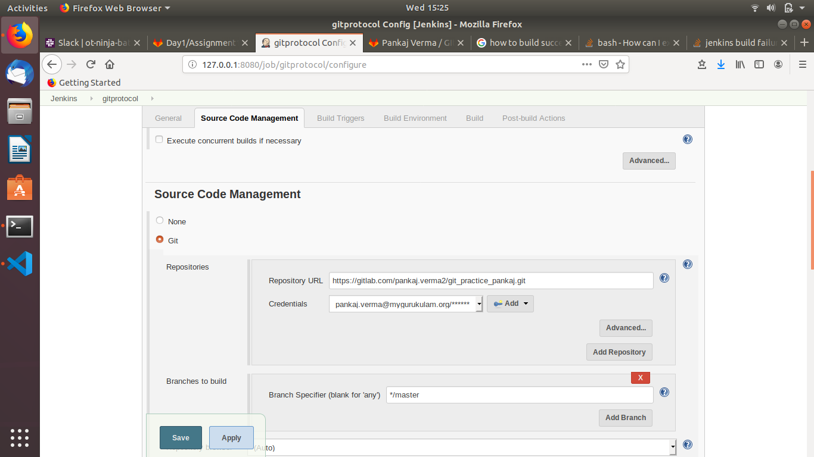
```     
    now save
    build now
    * Using ssh protocol
    generate ssh key using
    ssh-keygen
    now copy your public key to git account
```

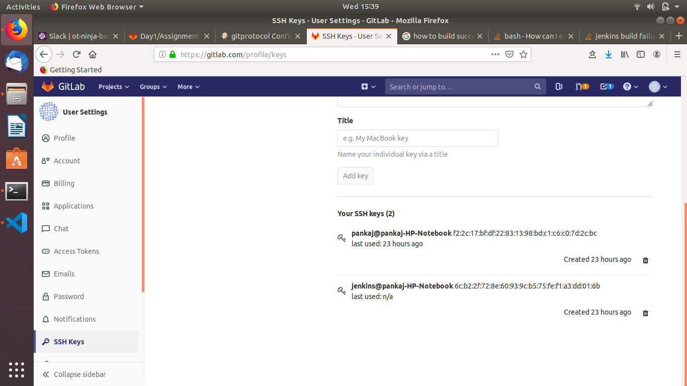

```    
    now add your private key to jenkins
    now clone using ssh link
```
    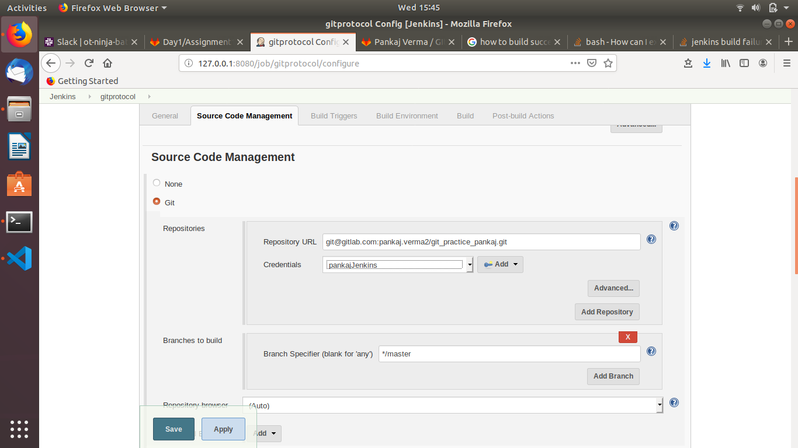


* Update above jenkins job so that it should be able to identify if there is a code commit in last 5 minutes it should get triggered.

```

install git plugin
select when change is pushed to git
```
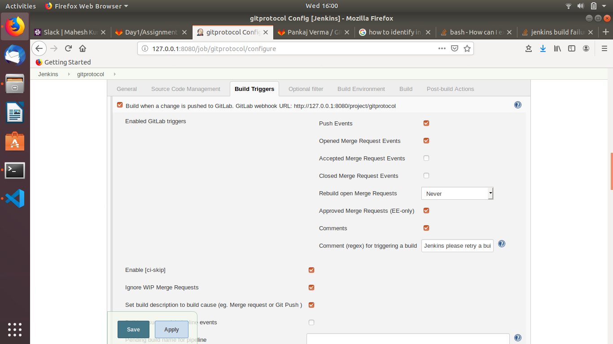

```
select poll scm

```
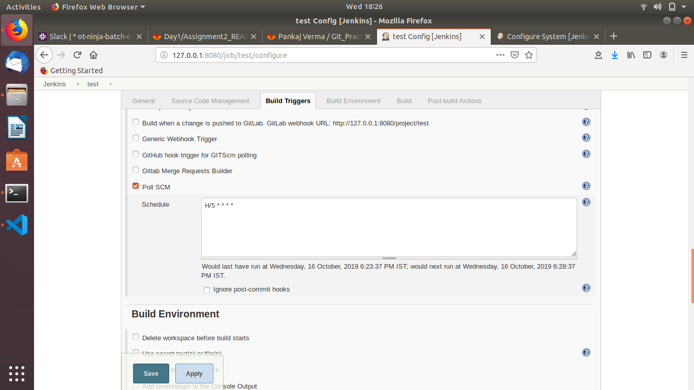

```
now save

```
* Enable colored console output

```

go to manage jenkins
go to manage plugins
install AnsiColor plugin
```
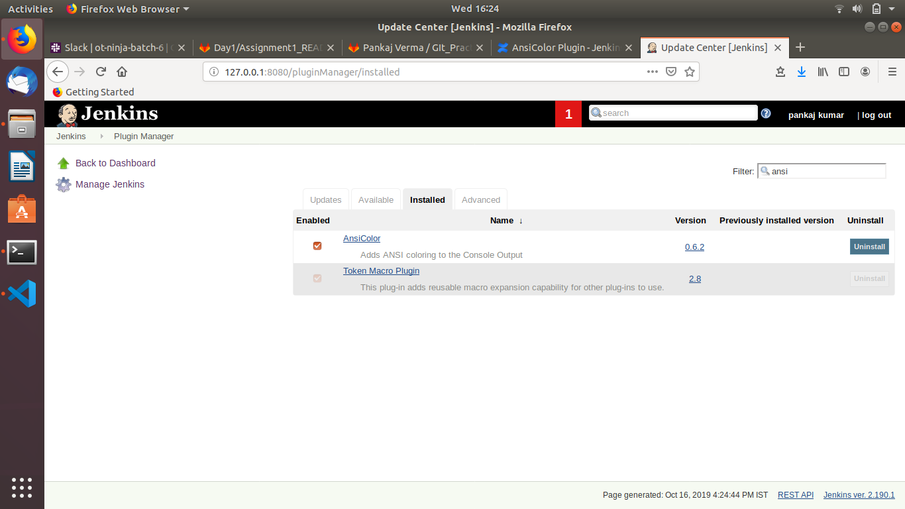
```
now in configure option
select Color Ansi Console Output
```
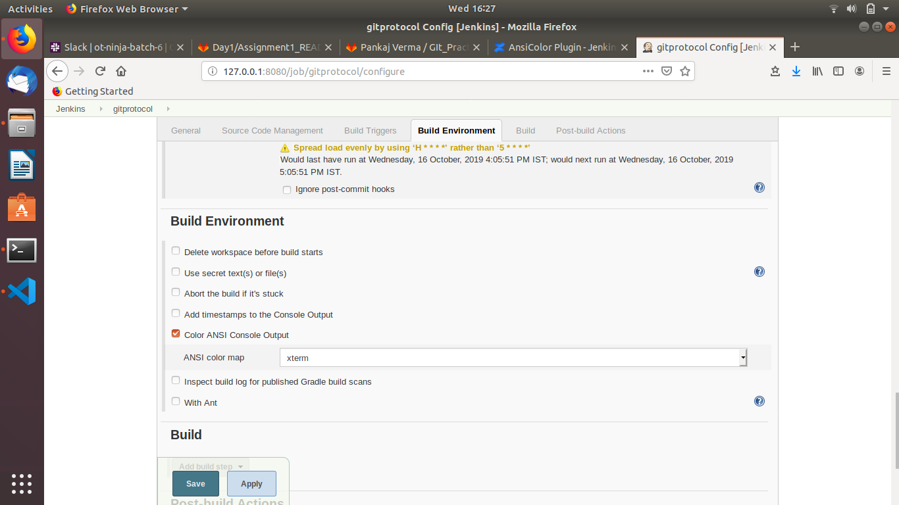


### Good to Do
* Clone the code available in the same repository only if there is changes in *java* folder and only this folder should be checked out.

* Integrate above Jenkins job to integrate with GitLab so that any commit in last 5 minutes will trigger this Jenkins job

* Summarize all important Additional checkout behaviour

## Summary
In this section we have gone through various options of freestyle Jenkins job.


# Learning by Doing | Jenkins Setup

## Introduction
In this section we will work on Security aspect of Jenkins along with some other Jenkins jobs


## References
*

## Assignments
### Must Do
* Create a Jenkins job(InstallPackage) that will take a package name as input and install it in local system.

```
Add jenkins user to sudoers file
```
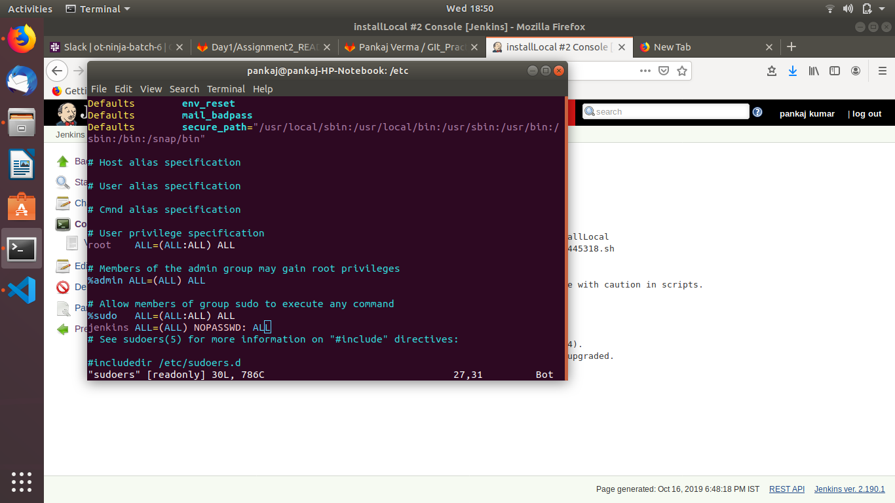

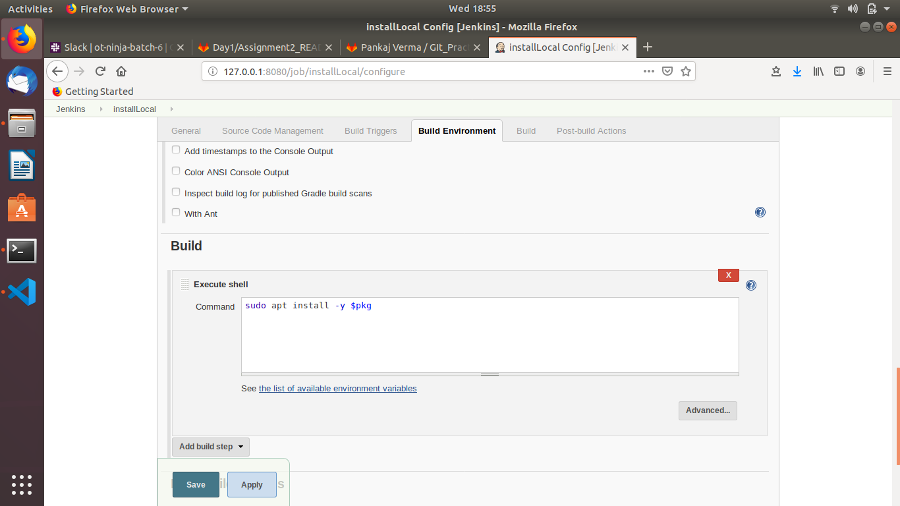


* Modify InstallPackage jenkins job to take remote system IP as input to install the package.
* Modify InstallPackage jenkins job so that it should be able to support different types of OS such as:
  * Ubuntu 14/16
  * CentOS 6/7

  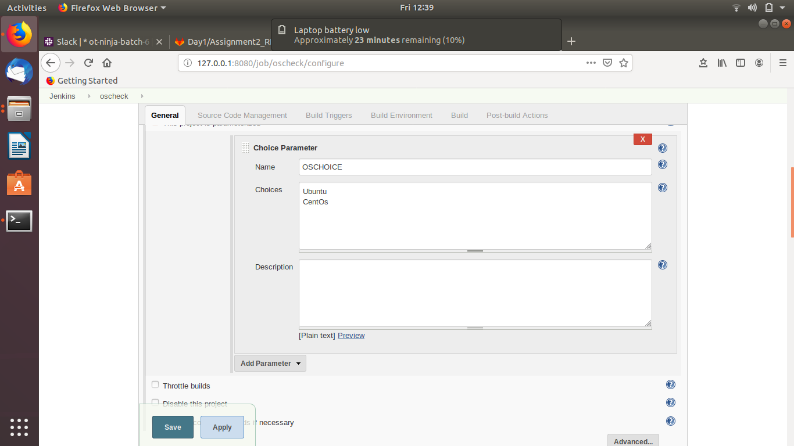
  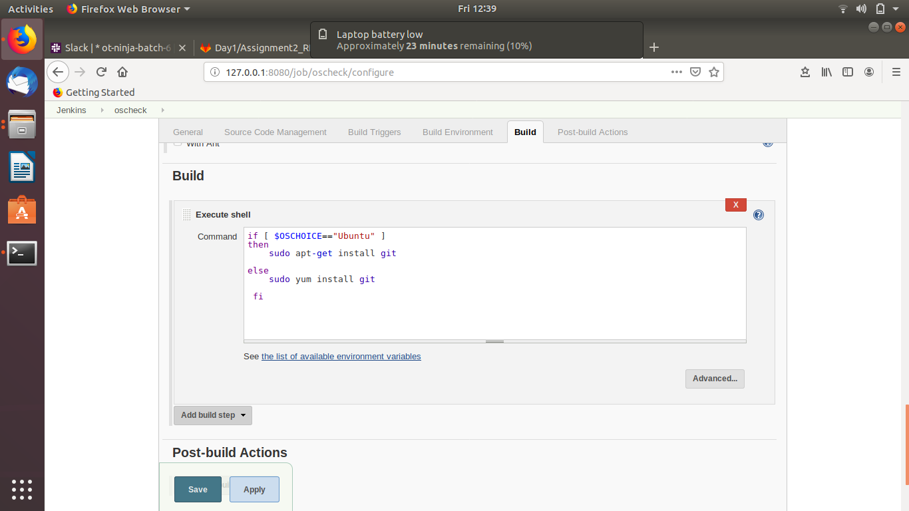
  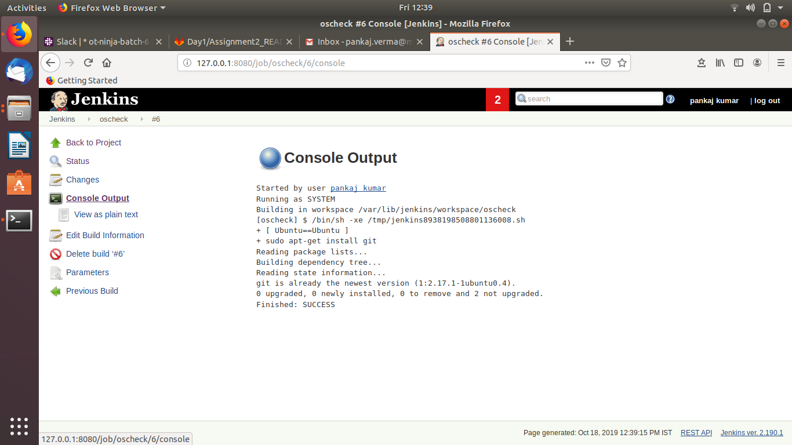
* Modify InstallPackage jenkins job to take additional parameters for remote system to be managed:
  * ssh username
  * PrivateKey file
* Modify InstallPackage jenkins job where a drop down will be provided of remote systems to be managed.
* Modify InstallPackage jenkins job where checkboxes are provided for multiple remote systems.
* Modify InstallPackage jenkins job which will take a meta file as an input in below format

```host, ip, user, private_key_file, package```

the above said file can have 1 or more entries

* Create below users in your system
  * dev
  * qa
  * devops
  ```
  First create 3 users dev, qa, devops by going to manage Jenkins and then manage users.
  ```
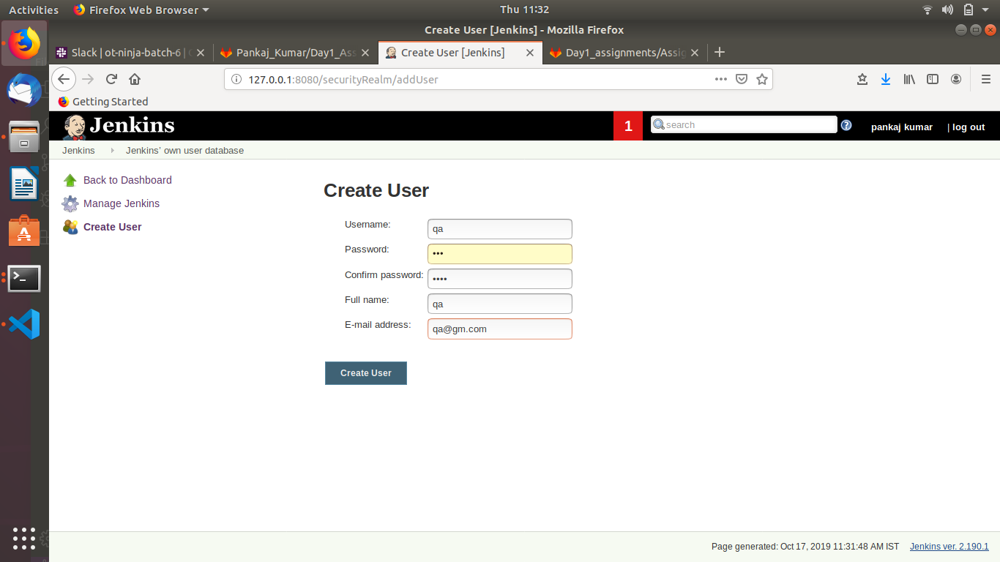

* qa user should be allowed only to execute the InstallPackage jenkins job
* dev user should be allowed to execute and view the content of InstallPackage jenkins job
* devops user should be admin of Jenkins server

  ```
  install plugin called "role based authorization plugin".
  now go to Configure Global Security
  select role based stratgey
  now save
  ```
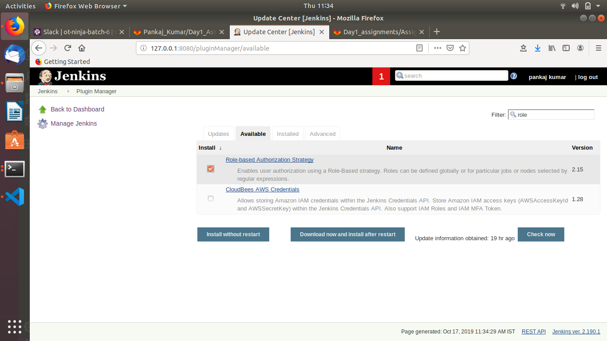

```
create and manage roles under global roles. Create roles by providing role names and clicking add button
```
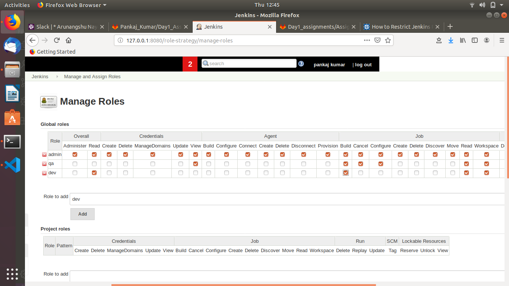

```
Now come to project roll section. Add roll and pattern in this section. Assign the jobs “Install_package” to the roll created. Make sure you write the exact project name/Job name in pattern section otherwise the roll will be unable to find the job name later. Give the access to created roll as per the requirement

Now it’s time to assign the rolls. Add the three user’s that we have created in global roles and tick check marks for respective project rolls that we have created above for respective users.
For user “devops” give the admin access inside global assign rolls
```
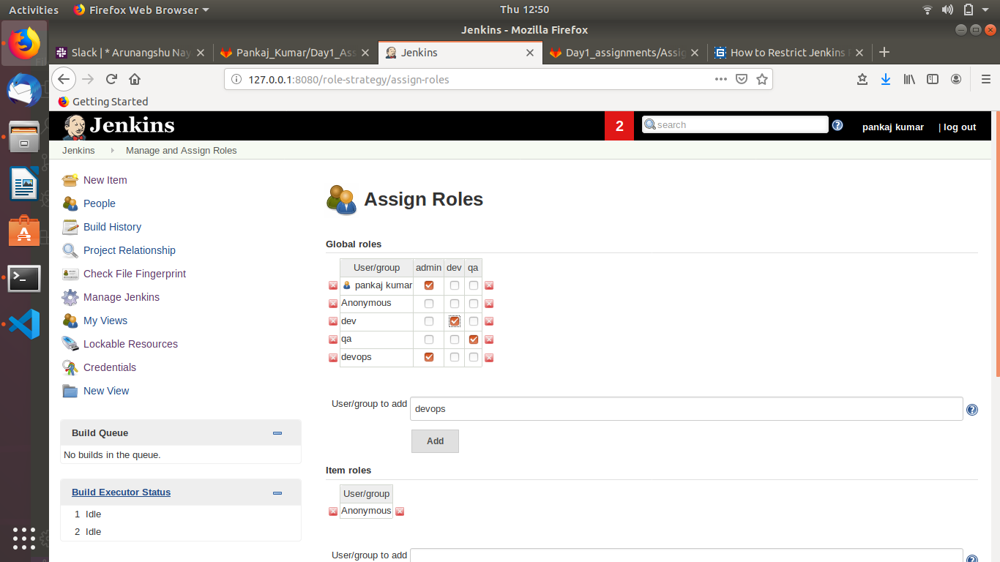
### Good to Do
* Implement InstallPackage using Jenkinsfile 
* Use gmail for Authentication
* Create 3 roles in Jenkins Server
  * dev
  * qa
  * devops
* qa role user should be allowed only to execute the InstallPackage jenkins job
* dev role user should be allowed to execute and view the content of InstallPackage jenkins job
* devops role user should be admin of Jenkins server

## Summary
In this section you learned about Authentication & Authorization
