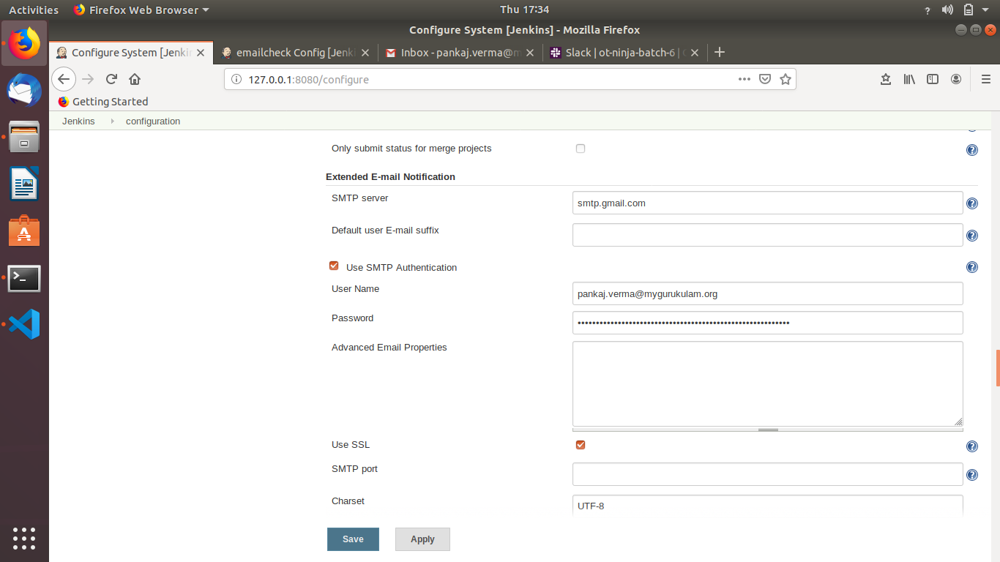
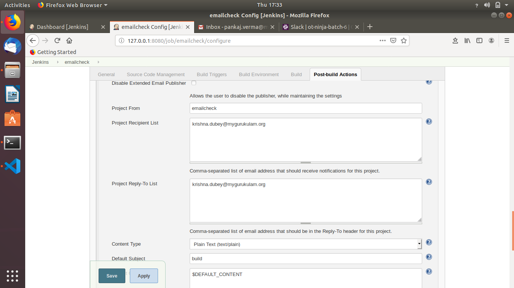
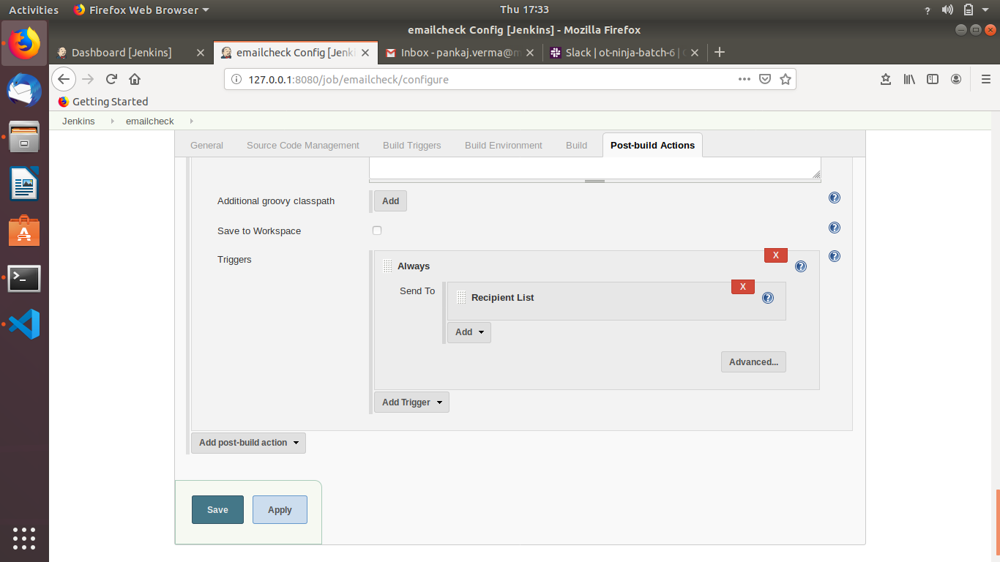
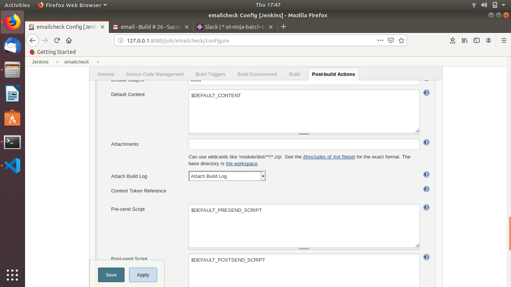
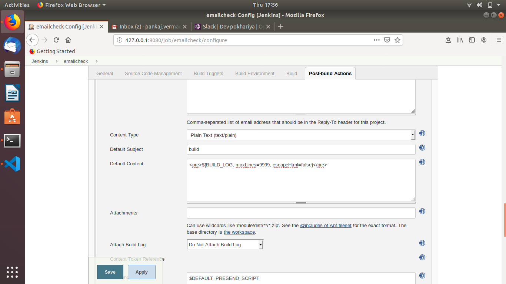
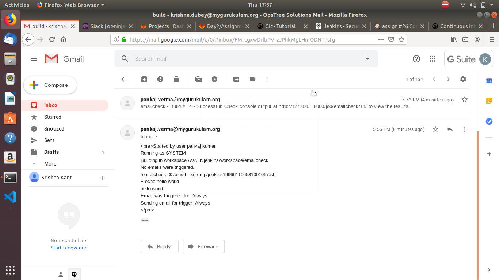
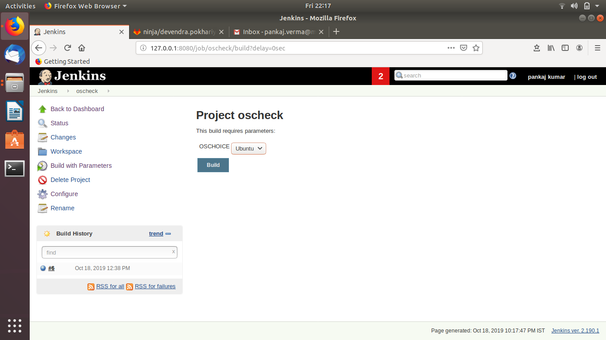

# Learning by Doing | Jenkins Setup

## Introduction
In this section we will work on Notification aspect of Jenkins along with some other Jenkins jobs

## References
*

## Assignments
### Must Do
* Create a Jenkins job that should send an EmailAlert on every execution.
```
go to manage jenkins
go to configure system
```


```
go to default triggers
```


```
now save the changes
```



* Modify above Jenkins job to send notification only in case of state change i.e when it fails for first time, or succeed after failure

* Modify above Jenkins job to send console output as an attachment.

* Modify above Jenkins job to add console output as mail body instead of attachment.



* Create a Jenkins job(ManageUser) that will take a user name as input and create it in local system.


* Modify ManageUser jenkins job to take remote system IP as input to create the user.

* Modify ManageUser jenkins job so that it should be able to support different types of OS such as:
  * Ubuntu 14/16
  * CentOS 6/7



* Modify ManageUser jenkins job to take additional parameters for remote system to be managed such as:
  * username
  * user home directory
  * user login shell
* Modify ManageUser jenkins job where a drop down will be provided of remote systems to be managed.
* Modify ManageUser jenkins job where checkboxes are provided for multiple remote systems.
* Modify ManageUser jenkins job which will take a meta file as an input in below format

```host, ip, user, private_key_file, username, home_directory(optional), login_shell(optional)```

the above said file can have 1 or more entries

* Suppose there is one tester in your team and he wants access in jenkins. You need to give him below access in jenkins :
   1. He should have build, configure , cancel and view type of access on jenkins job which start from "Tester-" name.
   2. For rest of the jenkins job , he should have read only access.(He should not be able to build, cancel or configure the job)


### Good to Do
* Create a Jenkins job that should send a Slack notification on every execution.
* Modify above Jenkins job to send Slack notification only in case of state change i.e when it fails for first time, or succeed after failure

* Implement ManageGroup similar to ManageUser.
* Implement ManageGroup using Jenkinsfile
* Implement ManageUser using Jenkinsfile


## Summary
In this section you learned about Authentication & Authorization
