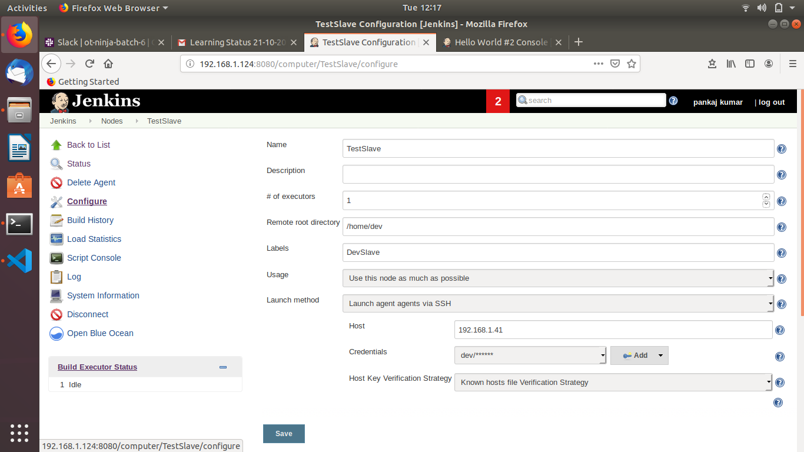

Assignment1:

Create a jenkins slave and add it to jenkins master.

Restrict jobs for jenkins slave which you have created.

Create a job that can run on either on master or slave.

Assignmnet2:

##Use jenkins rest api to

Get the list of all jobs

Get the last build status

Get the console o/p of a job build.

Trigger a jenkins job build

