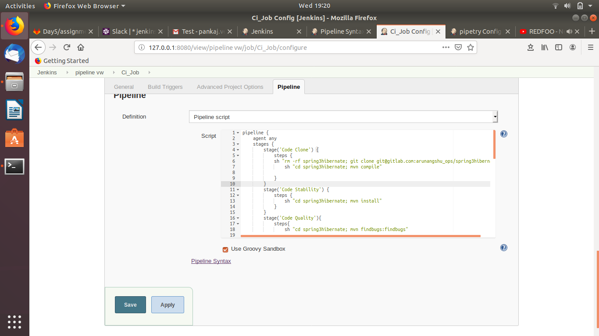

Must Do

Create a pipeline job for CI which will include below stages.

Checkout code (Clone spring3hibernate)
Code Stability
Code Quality
Code Coverage

Email Notification (Notification must contains job console URL and the username who started the job)

Slack Notification (Notification must contains job console URL and the username who started the job)

Publish Code coverage and checkstyle report in above pipeline job

If issues in above health reports is greater than 2, then job should get failed.

Create a Job DSL for above pipeline job and using Job DSL, create same pipeline job with different name.

Good to Do

Write scripted pipeline instead of declarative pipeline for above task.

Instead of using "sh" parameter in pipeline script for maven commands, use maven plugin
Create functions for slack and email notification in pipeline script.