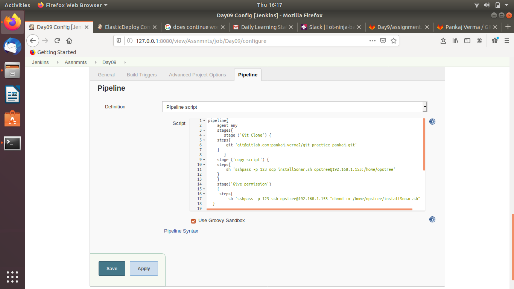
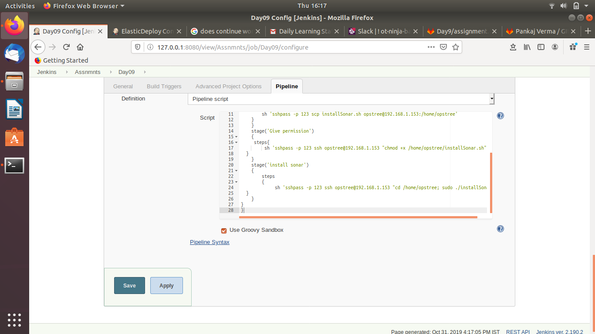
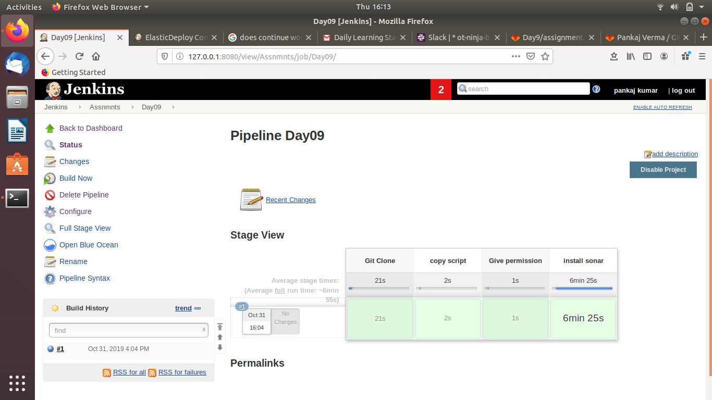
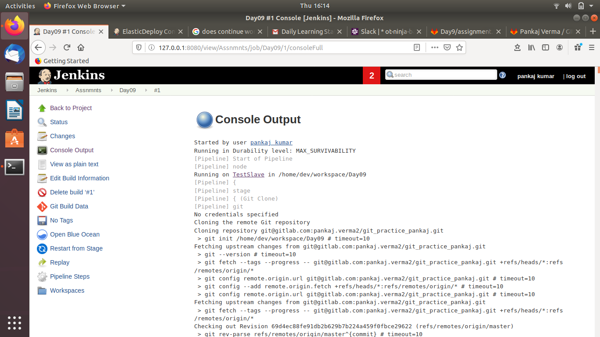
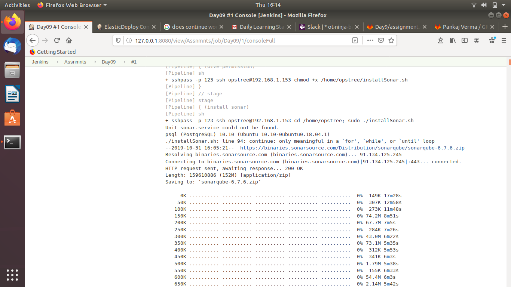
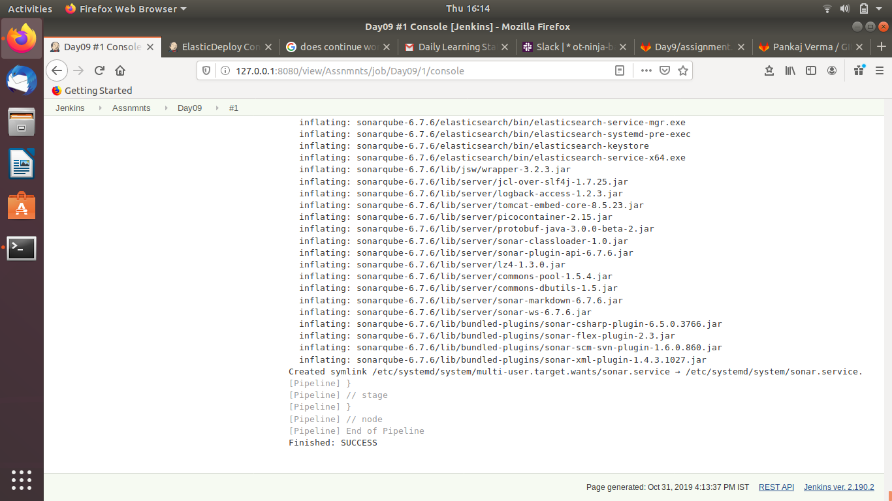
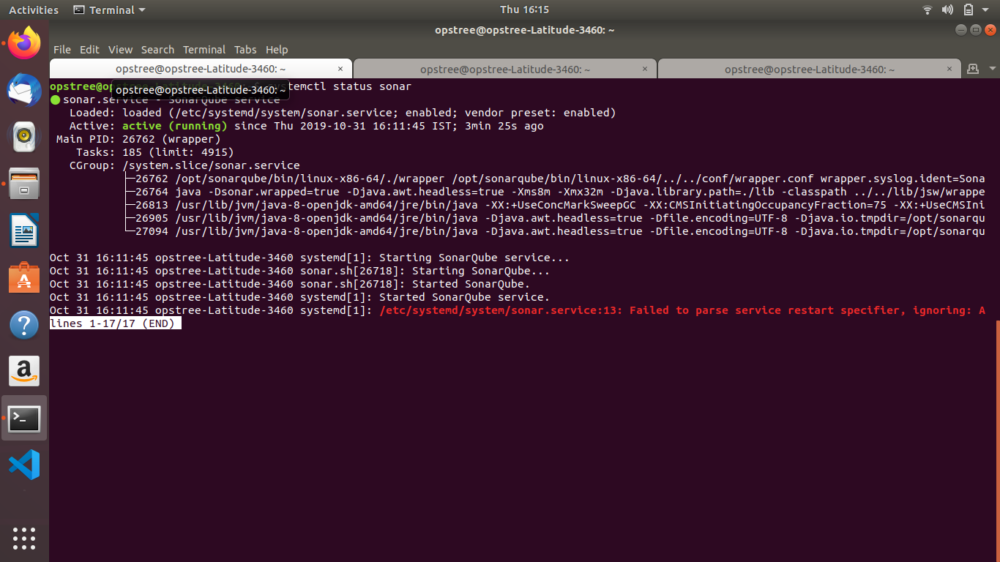

Must Do

Create a jenkins pipeline job which will install the specific software (on localhost or remote server) which has een assigned to you.
Decide by yourself about the inputs from the user and the pipeline stages.
Create the pipeline script which will follow best practices in Devops perspective.

REMOTE SERVER INSTALLED

