# Learning by Doing | Jenkins Setup

## Introduction
In this section we will learn how to work with freestyle jenkins jobs.

## References
* https://www.tutorialspoint.com/jenkins/index.htm

## Assignments
### Must Do
* Create a freestyle job to print "Hello world".
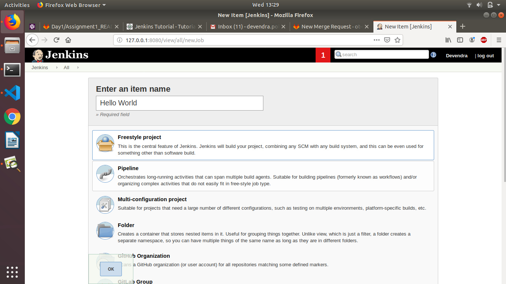
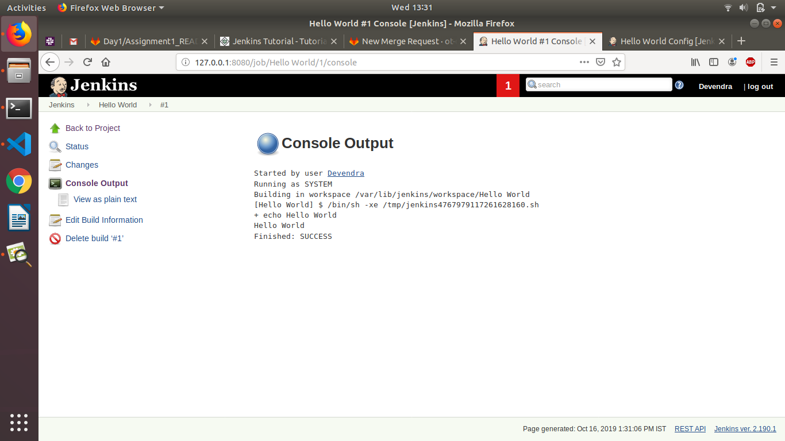
* Create a freestyle job to which take absolute path of a directory then
    * List all files and directories inside that.
    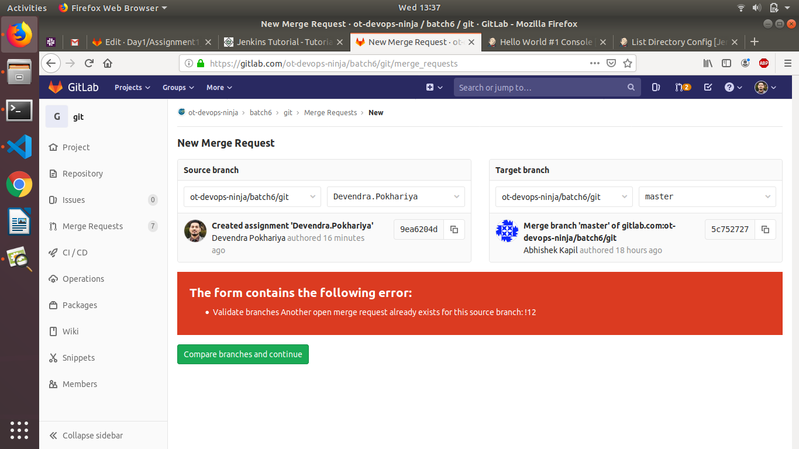
    * Print a message "directory not exist" if directory doesn't exist on file system
    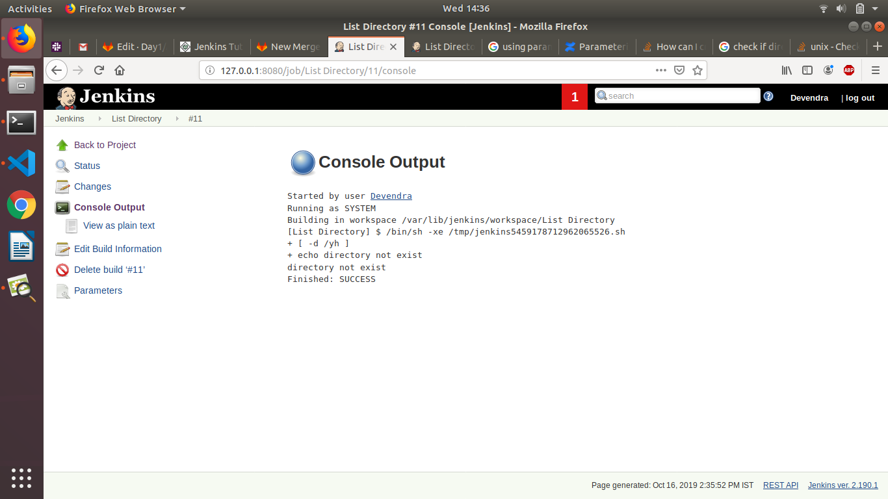

    * Print "Inappropriate permissions" if you don't have permissions to list files.
     

* Update the previously created freestyle job to only retain last 10 build history but not beyond 2 days.
 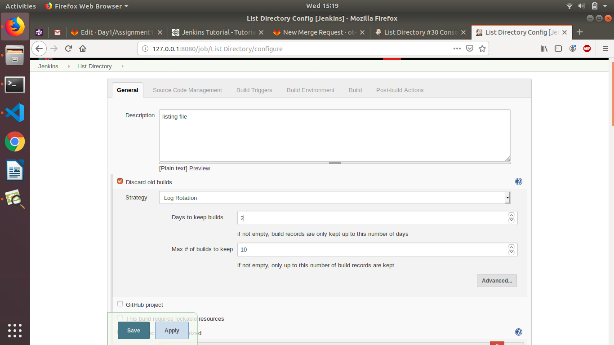
* Clone the code available in the same repository.
    * Using git protocol
         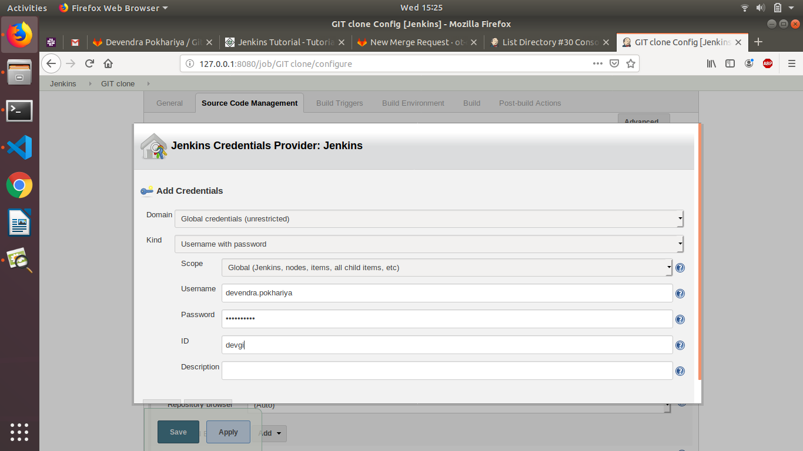

         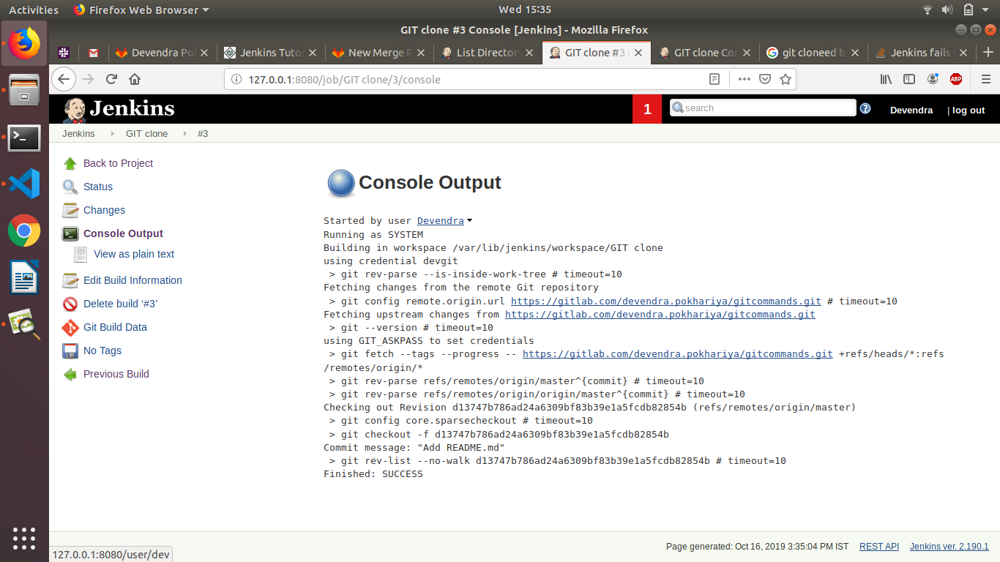
    * Using ssh protocol
     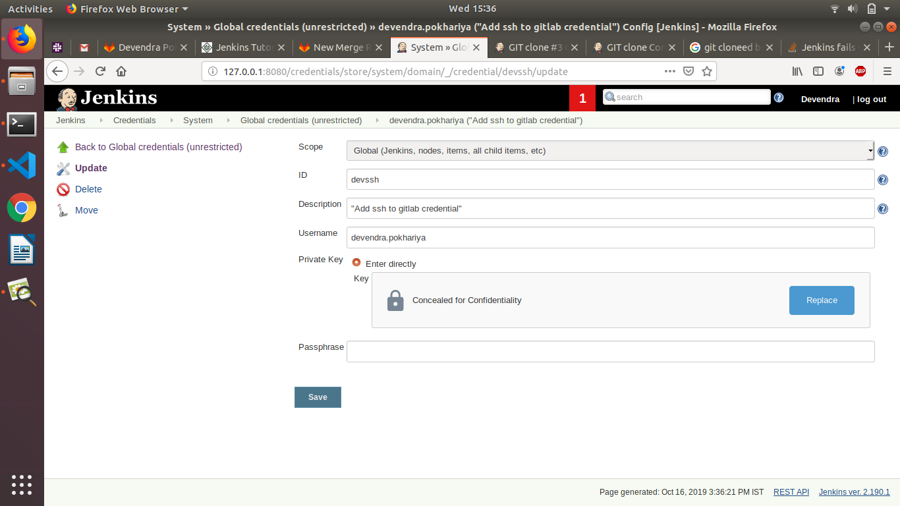

     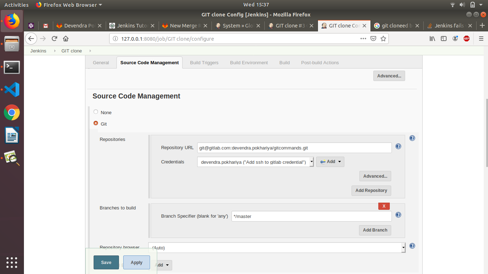
* Update above jenkins job so that it should be able to identify if there is a code commit in last 5 minutes it should get triggered.
 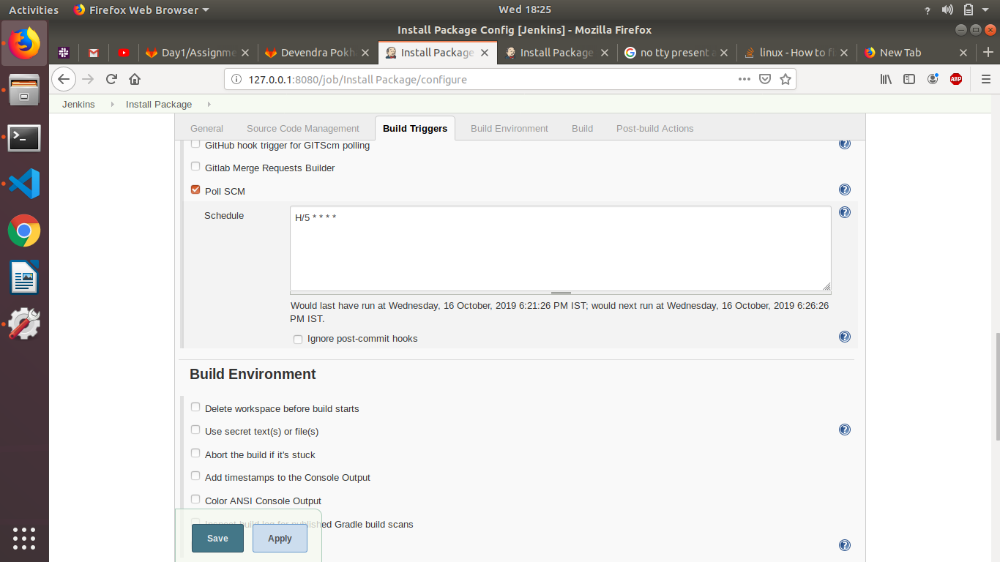

 


* Enable colored console output
 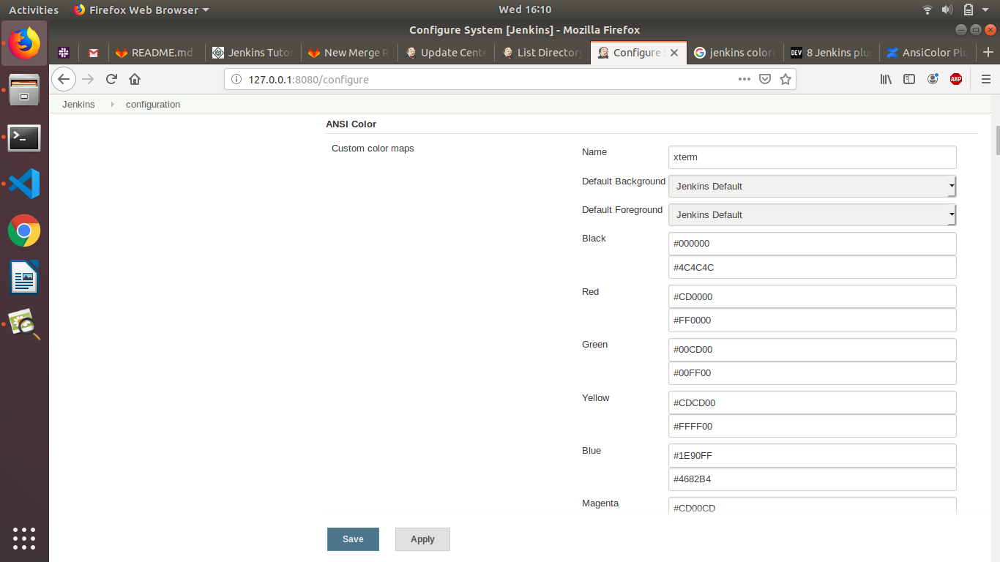

 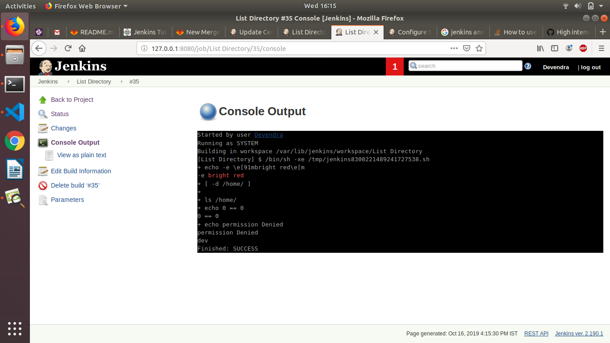
*

### Good to Do
* Clone the code available in the same repository only if there is changes in *java* folder and only this folder should be checked out.

    

* Integrate above Jenkins job to integrate with GitLab so that any commit in last 5 minutes will trigger this Jenkins job

* Summarize all important Additional checkout behaviour

## Summary
In this section we have gone through various options of freestyle Jenkins job.


# Learning by Doing | Jenkins Setup

## Introduction
In this section we will work on Security aspect of Jenkins along with some other Jenkins jobs

## References
*

## Assignments
### Must Do
* Create a Jenkins job(InstallPackage) that will take a package name as input and install it in local system.
 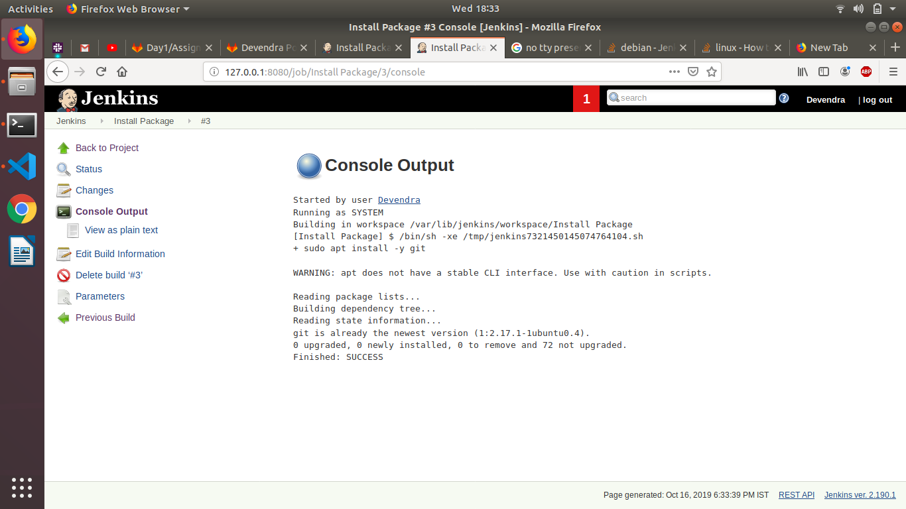

give sudoers permission if there is a error

 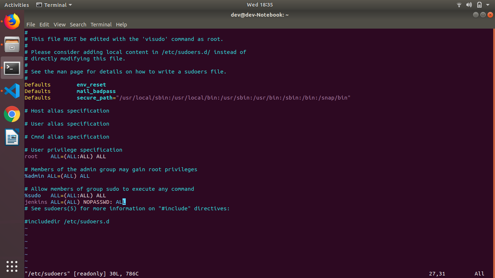

* Modify InstallPackage jenkins job to take remote system IP as input to install the package.


* Modify InstallPackage jenkins job so that it should be able to support different types of OS such as:
  
  * Ubuntu 14/16
  * CentOS 6/7

 
 
 

* Modify InstallPackage jenkins job to take additional parameters for remote system to be managed:
  * ssh username
  
  * PrivateKey file


* Modify InstallPackage jenkins job where a drop down will be provided of remote systems to be managed.
* Modify InstallPackage jenkins job where checkboxes are provided for multiple remote systems.
* Modify InstallPackage jenkins job which will take a meta file as an input in below format

```host, ip, user, private_key_file, package```

the above said file can have 1 or more entries

* Create below users in your system
  * dev
  * qa
  * devops

  

* qa user should be allowed only to execute the InstallPackage jenkins job


* dev user should be allowed to execute and view the content of InstallPackage jenkins job


* devops user should be admin of Jenkins server


### Good to Do
* Implement InstallPackage using Jenkinsfile

* Use gmail for Authentication

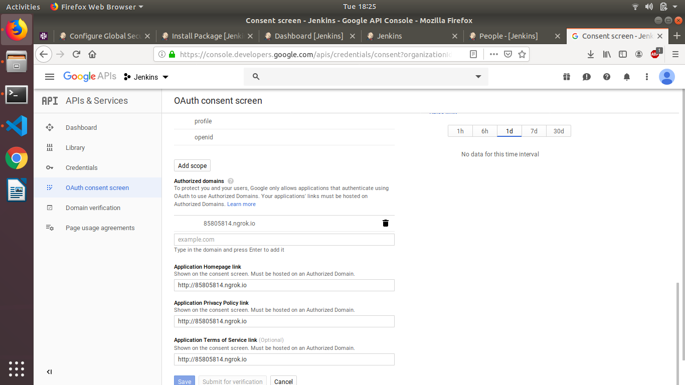

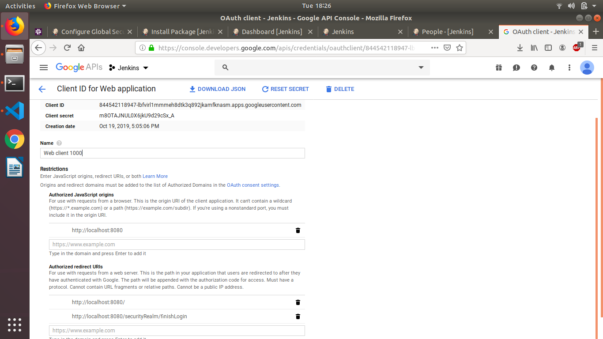

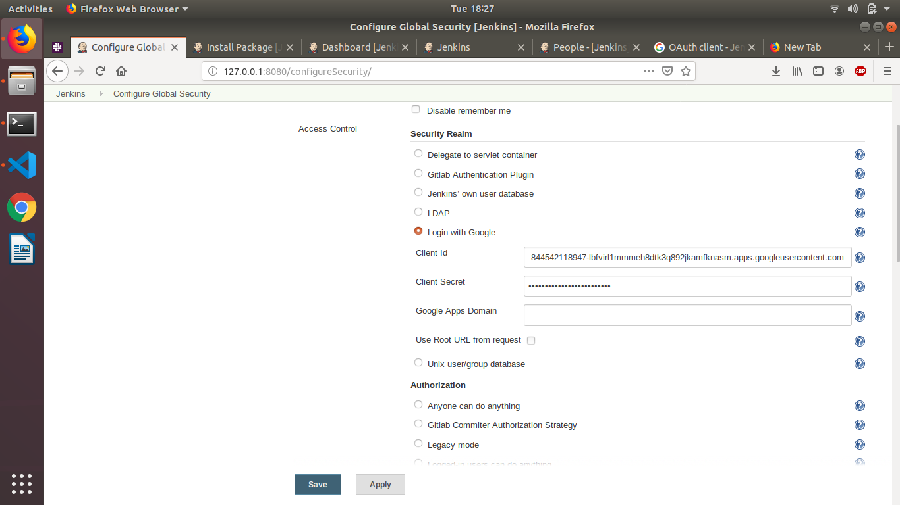

* Create 3 roles in Jenkins Server
  * dev
  * qa
  * devops
  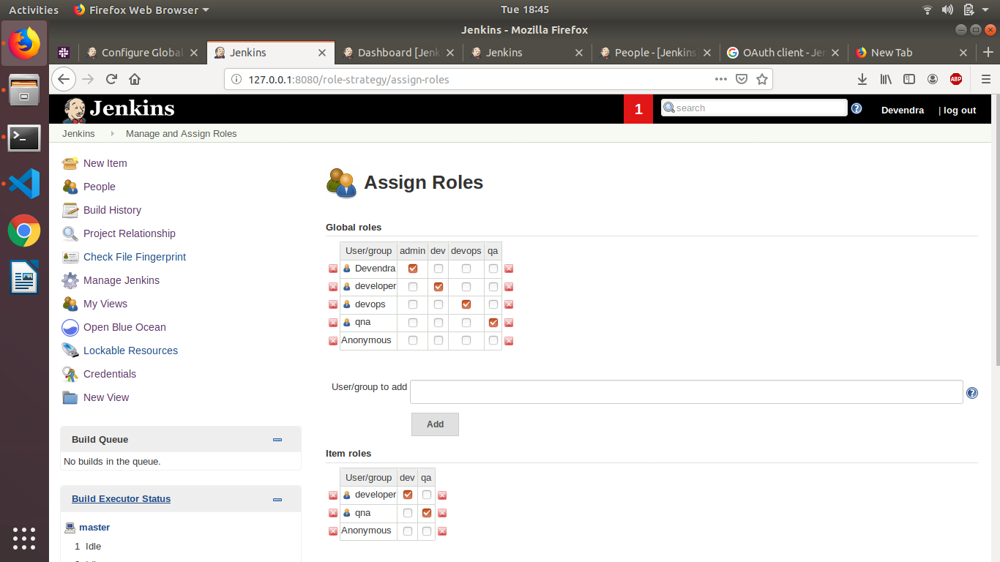
* qa role user should be allowed only to execute the InstallPackage jenkins job
* dev role user should be allowed to execute and view the content of InstallPackage jenkins job
* devops role user should be admin of Jenkins server


## Summary
In this section you learned about Authentication & Authorization
