# Learning by Doing | Jenkins Setup

## Introduction
In this section we will work on Views and JenkinsFile in Jenkins jobs

## References
*

## Assignments
### Must Do
* Let's assume you are working on 3 projects, PROJECT1, PROJECT2, PROJECT3
* Project1 has 3 environments DEV, QA, PROD
* Project2 has 4 environment DEV, QA, UAT, PROD
* Project3 has 5 environment DEV, QA, UAT, PT, PROD
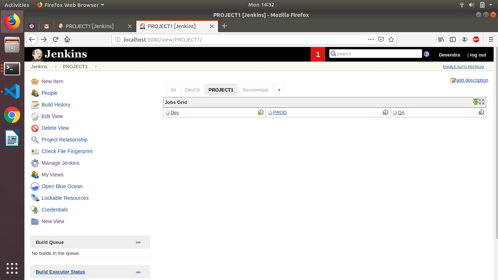
* Now as you are already aware for each project you will have CI jobs and deployment jobs, create dummy jobs.
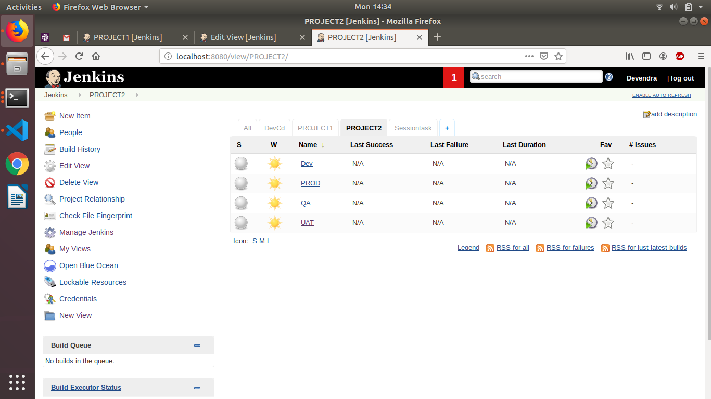
* Arrange your jobs in Jenkins in such a fashion that it will be easy to manage them and for a new person it will be pretty easy to understand which job belong to which project.

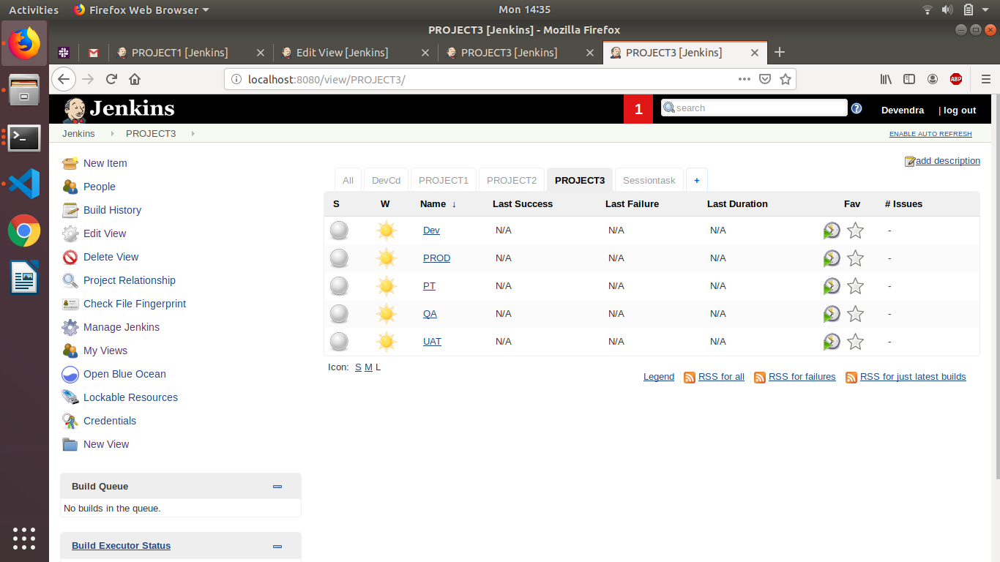

* Create a Jenkins job(ManageTemplate) that will take a template file, property file(value of variables used in template file) and location as input and then create a file in local system.
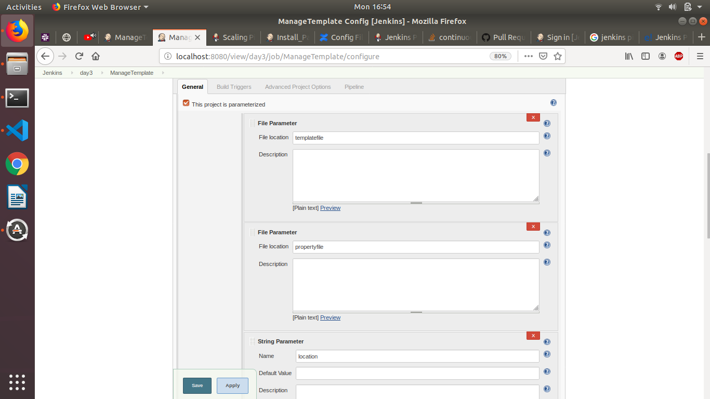
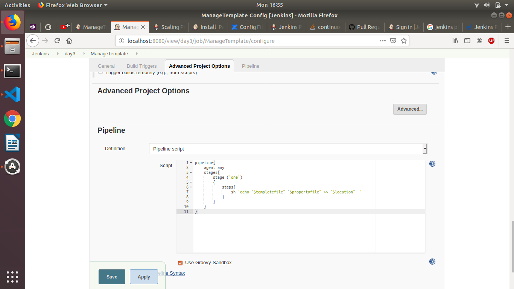

* Modify ManageTemplate jenkins job to take remote system IP as input to create the file.
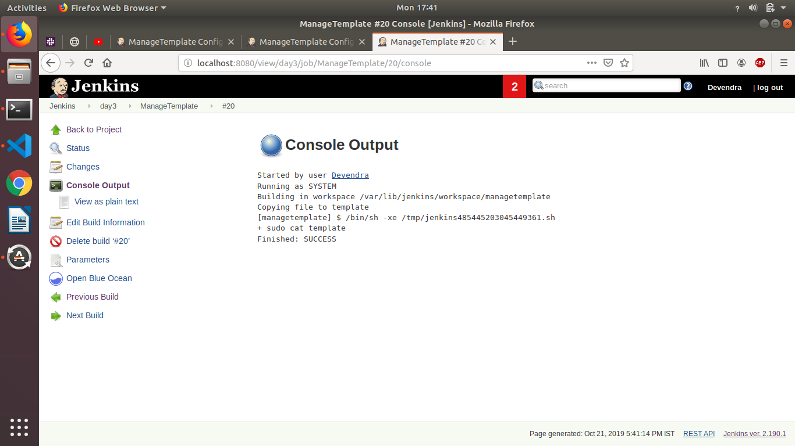
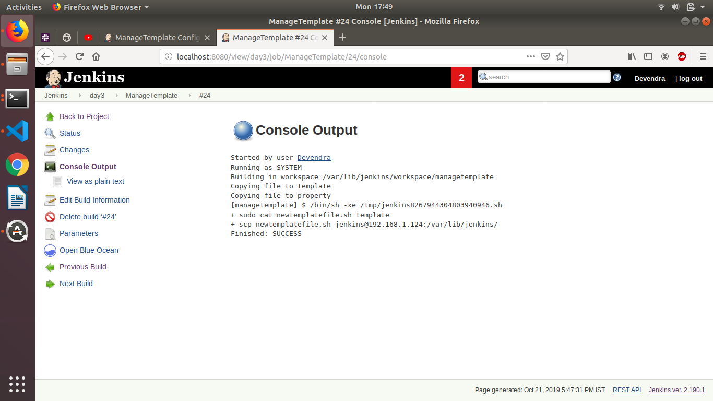
* Modify ManageTemplate jenkins job to take additional parameters for file to be managed such as:
  * permission
  * owner of file
  * group owner of file

 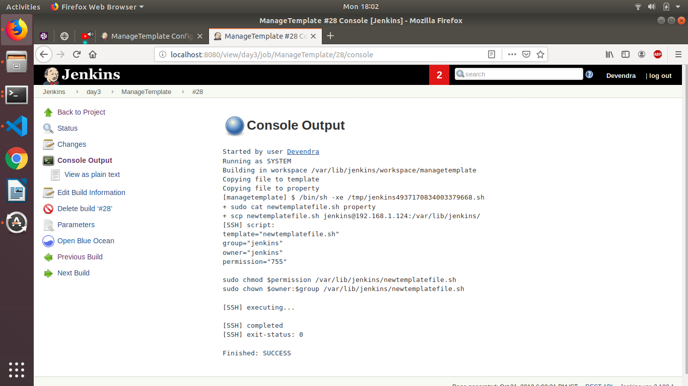

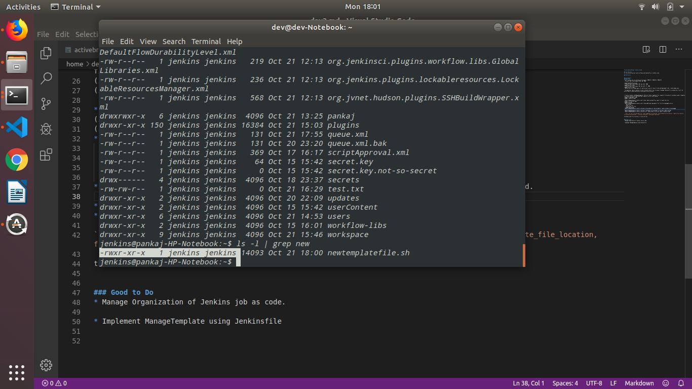

  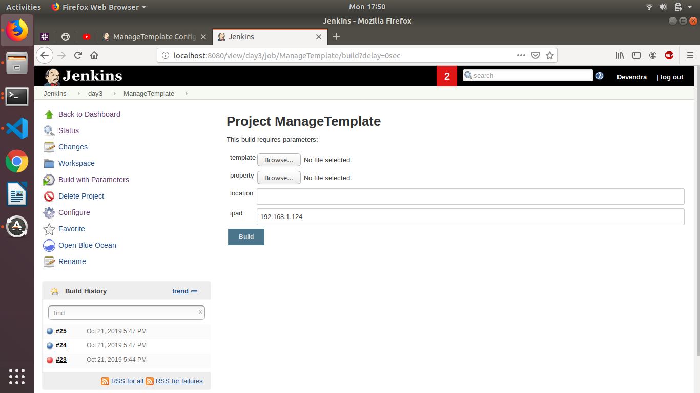
* Modify ManageTemplate jenkins job where a drop down will be provided of remote systems to be managed.

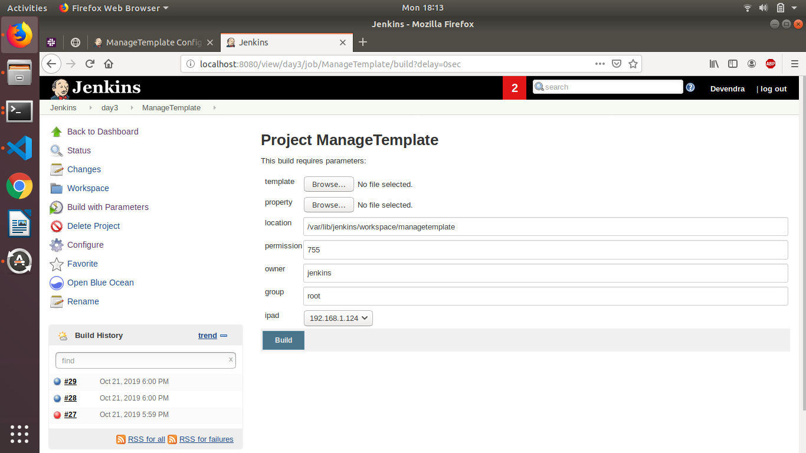

* Modify ManageTemplate jenkins job where checkboxes are provided for multiple remote systems.

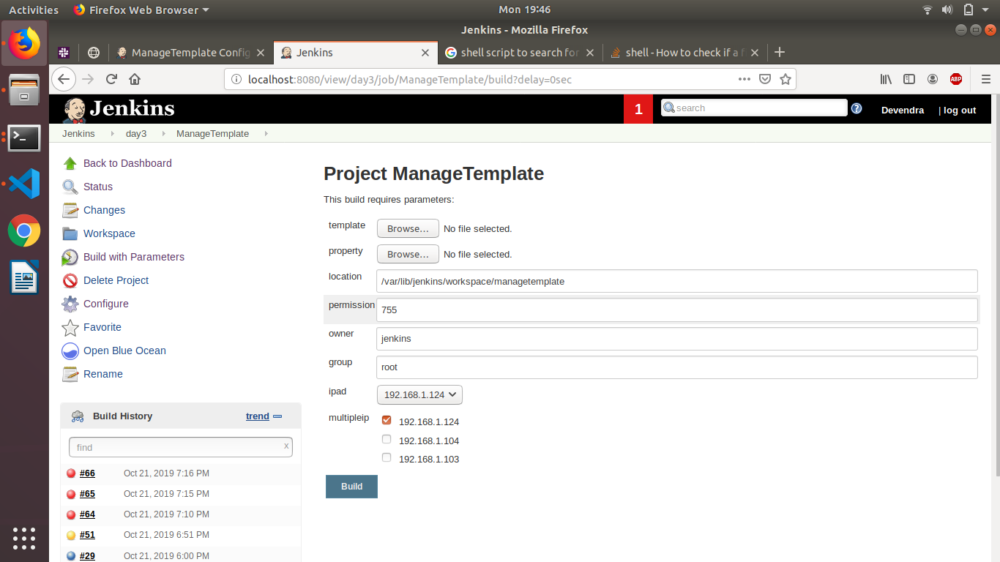

* Modify ManageTemplate jenkins job which will take a meta file as an input in below format

```host, ip, user, private_key_file, local_template_file_location, local_property_file_location, remote_file_location, file_permission(optional), file_owner(optional), group_owner(optional)```

the above said file can have 1 or more entries


### Good to Do
* Manage Organization of Jenkins job as code.

* Implement ManageTemplate using Jenkinsfile

