# Learning by Doing | Jenkins Setup

## Introduction
In this section we will work on Master slave setup in Jenkins and how to configure it acc to requirement.

## References
*

## Assignments
### Must Do

* Assignment1: 
	1. Create a jenkins slave and add it to jenkins master.
    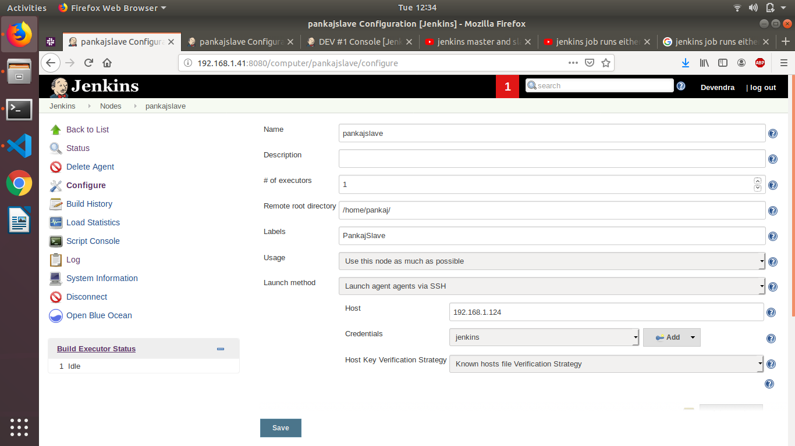
    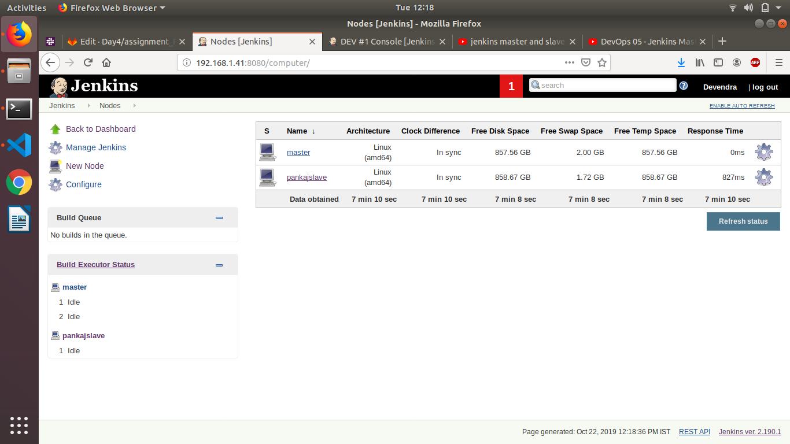
	2. Restrict jobs for jenkins slave which you have created.
    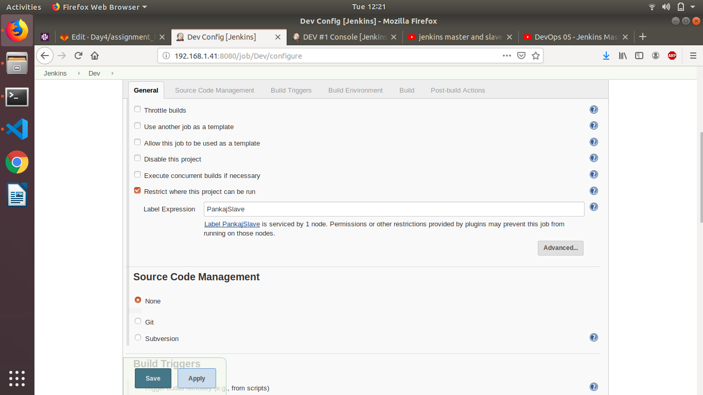
	3. Create a job that can run on either on master or slave.
    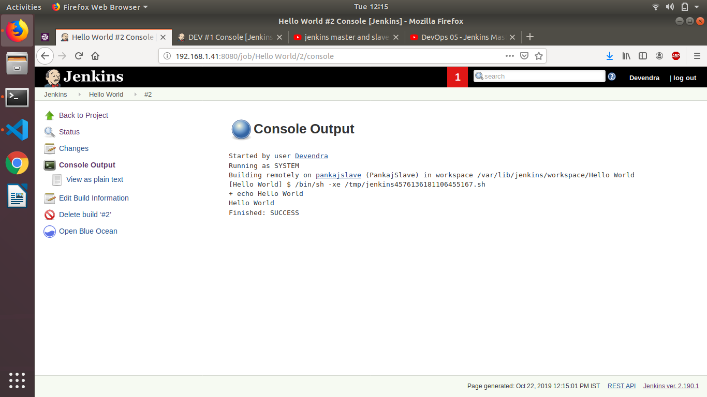
    

* Assignmnet2:
	1. Use jenkins rest api to 
		
        1. Get the list of all jobs 
       
        http://192.168.1.41:8080/api/json?tree=jobs[name]
       
        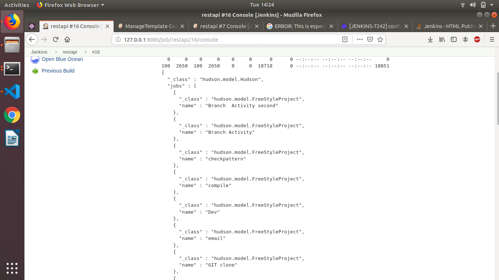
       
        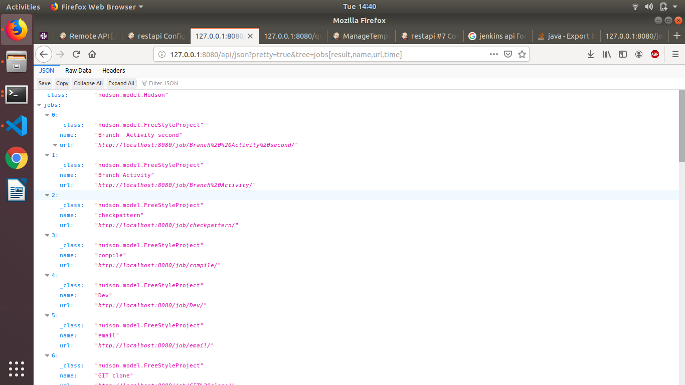

		2. Get the last build status
        
        http://127.0.0.1:8080/job/restapi/api/json?pretty=true&tree=allBuilds[number,url]
        
        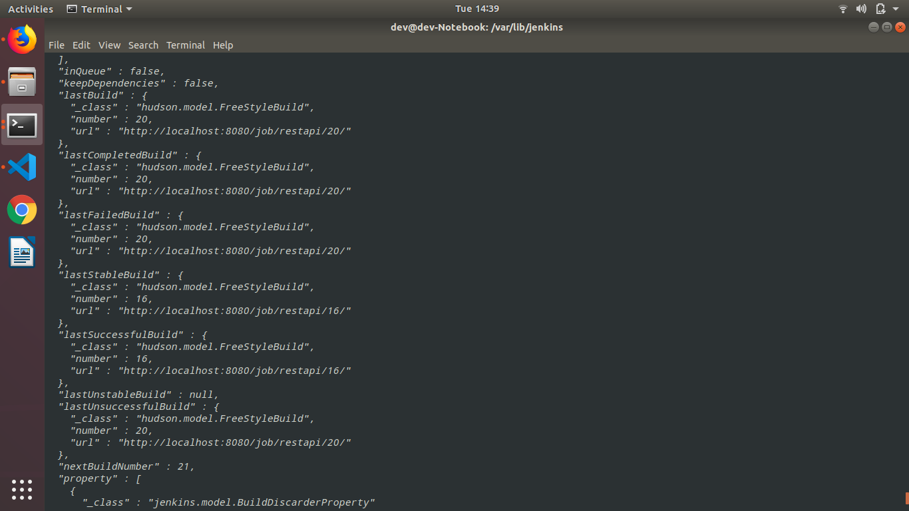
       
        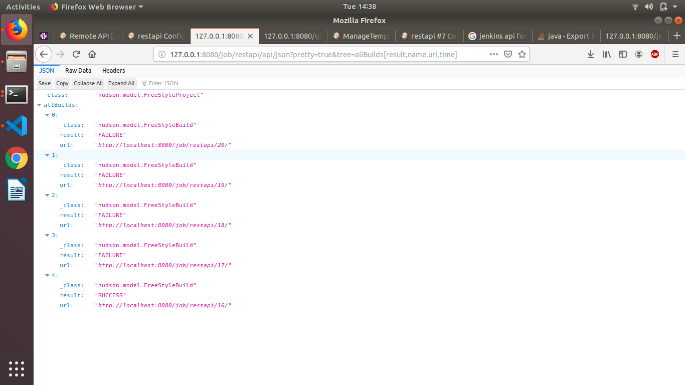
		
        3. Get the console o/p of a job build. 
       
        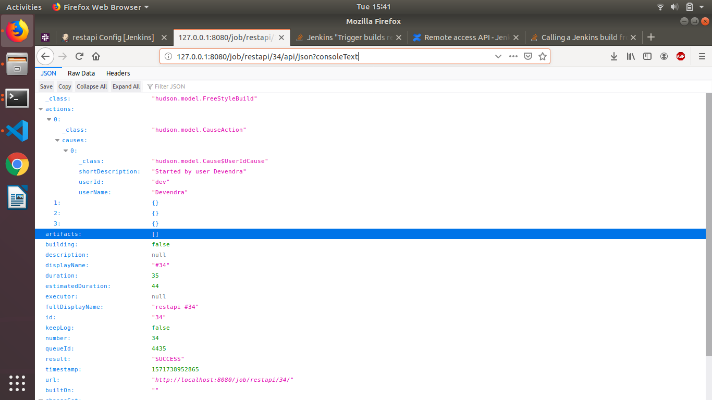
        
        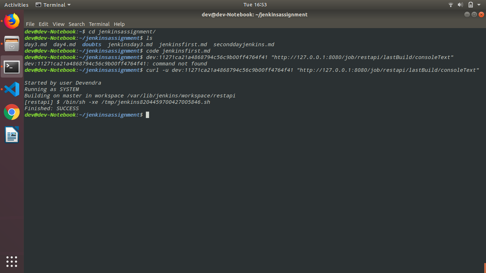
        
         	
    4. Trigger a jenkins job build.
          
           curl -v -X POST  -u   dev:11271ca21a4868794c56c9b00ff4764f41  "http://127.0.0.1:8080/job/restapi/build/"
          
          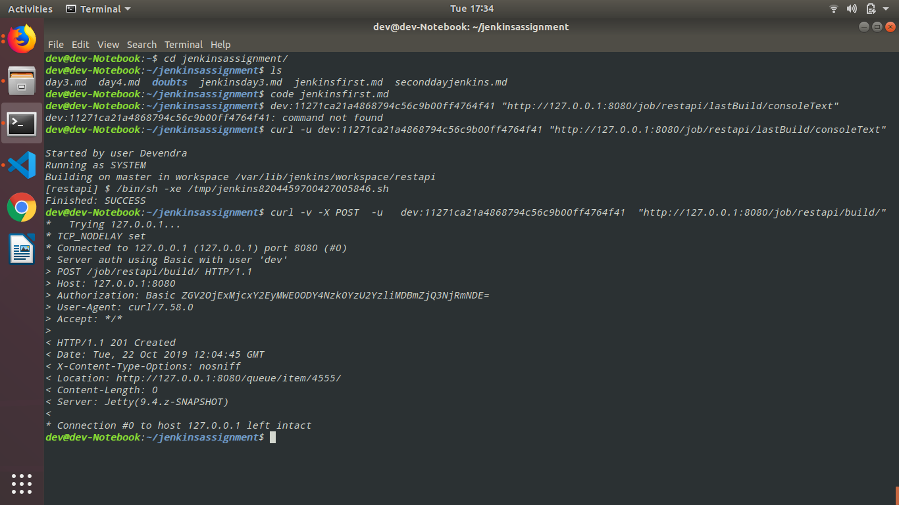
         
          ## end