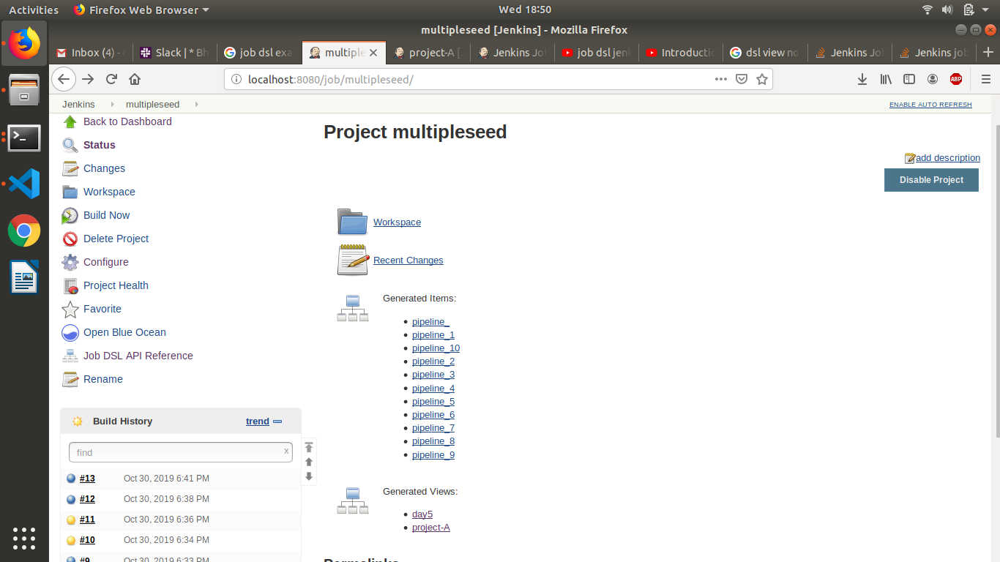

# Learning by Doing | Jenkins Setup

## Introduction
In this section we will learn CI concept

## Assignments
### Must Do
* Create a pipeline job for CI which will include below stages.
  1. Checkout code (Clone spring3hibernate)
  2. Code Stability [mvn verify]

  3. Code Quality [mvn findbugs:findbugs]
  4. Code Coverage [mvn chekstyle:checkstyle]

  5. Email Notification (Notification must contains job console URL and the username who started the job)
  
  6. Slack Notification (Notification must contains job console URL and the username who started the job)
  
* Publish Code coverage and checkstyle report in above pipeline job

* If issues in above health reports is greater than 2, then job should get failed.  

* Create a Job DSL for above pipeline job and using Job DSL, create same pipeline job with different name. 

Now write code for the pipeline job with definition

you will ge the end result

### Good to Do
* Write scripted pipeline instead of declarative pipeline for above task.

* Instead of using "sh" parameter in pipeline script for maven commands, use maven plugin

* Create functions for slack and email notification in pipeline script.
