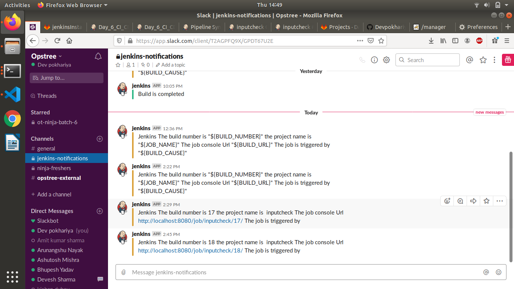

# Learning by Doing | Jenkins Setup

## Introduction
In this section we will learn CI-CD concept

## Assignments
### Must Do

* Create a pipeline job which will include below stages (Same like Day5 assignment).
  1. Checkout code (Clone spring3hibernate)
  2. Code Stability [mvn package]

  3. Code Quality [mvn findbugs:findbugs]
  4. Code Coverage [mvn chekstyle:checkstyle]
  

  5. Code Vulnerablity (Using snyk plugin, scan code vulnerablities and publish the report)
  
  Install the plugin 
  
  
  
  view the report online

  5. Email Notification (Notification must contains job console URL and the username who started the job)

  

  6. Slack Notification (Notification must contains job console URL and the username who started the job)

  

* Publish Code coverage and checkstyle report in above pipeline job

      
  7. Approval (Pipeline should wait for the input from the submitter. message will be "Do you want to continue Yes/No") 
  NOTE: only specific submitter should be able to approve to continue it, not other users.

  

  Submitter can approve

  

  8. Deployment (if submitter approved in previus stage, code should be deployed in remote server.)
  
  
  

  9. Slack Notification (Notification must contains job console URL and the username who started the job)

  10. Rollback (Pipeline should wait for the input from the submitter. Pipeline should ask submitter below inputs:
      a. Rollback Yes/No
    
      b. Git tag for rollback ) NOTE: only specific submitter should be able to approve to continue it, not other users. 
      
      

    If submitter approve this, rollback job should be triggered  (see below for rollback job)
      
      

    

* Create a pipeline job for rollback with below stages

  1. Checkout code (checkout code acc to git tag passed by above deployment job)
  2. Package
  2. Deployment (Deploy above code to remote server)
  3. Slack Notification (Notification must contains job console URL)deploy.png

Please refer Rollback File
  

  ### NOTE
* If pipeline fails in any stage, slack notification should be triggered and it should mention stage name where pipeline failed and error msg. 

### Good to Do
* Write scripted pipeline instead of declarative pipeline for above task.
* Instead of using "sh" parameter in pipeline script for maven commands, use maven plugin
* Create functions for slack and email notification in pipeline script.
* Store each artifact created by CI job in your server with <job_name>_<build_no> name. and then use this artifact while rollback, so that you dont have to recompile the previous code while rollback.
