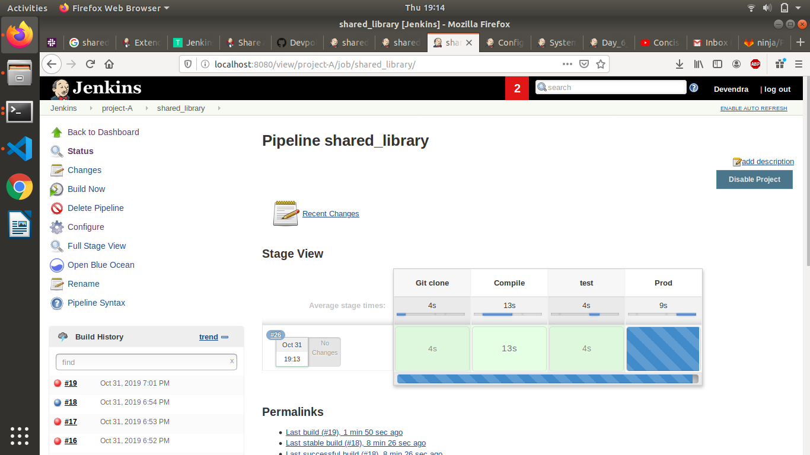

# Learning by Doing | Jenkins Setup

## Introduction
In this section we will learn shared library concept

## Assignments
### Must Do
* Suppose there are three env:
  1. Dev (dev branch)
  ]
  2. QA (qa branch)
  
  3. Stage (stage branch)
  
  4. Prod (prod branch)
  
  Create CI-CD pipeline for all env(same stages like previous assignment) which will use common jenkins shared library instead of pipeline script to build and deploy Spring3Hibernate app.

    configure the jenkins
    
running project
  

  ### NOTE
* First read about shared library and how to configure it in jenkins before using it.
