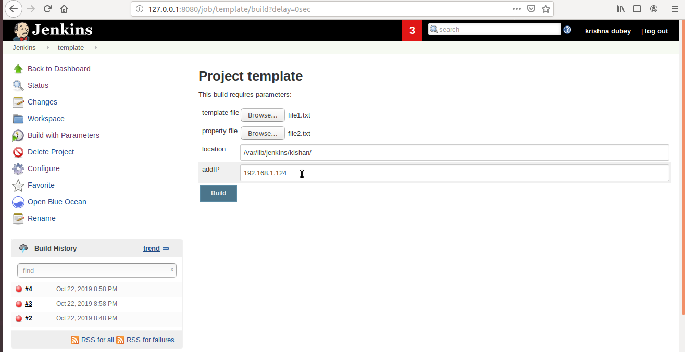

* Let's assume you are working on 3 projects, PROJECT1, PROJECT2, PROJECT3
* Project1 has 3 environments DEV, QA, PROD
* Project2 has 4 environment DEV, QA, UAT, PROD
* Project3 has 5 environment DEV, QA, UAT, PT, PROD
* Now as you are already aware for each project you will have CI jobs and deployment jobs, create dummy jobs.
* Arrange your jobs in Jenkins in such a fashion that it will be easy to manage them and for a new person it will be pretty easy to understand which job belong to which project.

* Create a Jenkins job(ManageTemplate) that will take a template file, property file(value of variables used in template file) and location as input and then create a file in local system.

* Modify ManageTemplate jenkins job to take remote system IP as input to create the file.

* Modify ManageTemplate jenkins job to take additional parameters for file to be managed such as:
  * permission
  * owner of file
  * group owner of file

* Modify ManageTemplate jenkins job where a drop down will be provided of remote systems to be managed.

* Modify ManageTemplate jenkins job where checkboxes are provided for multiple remote systems

