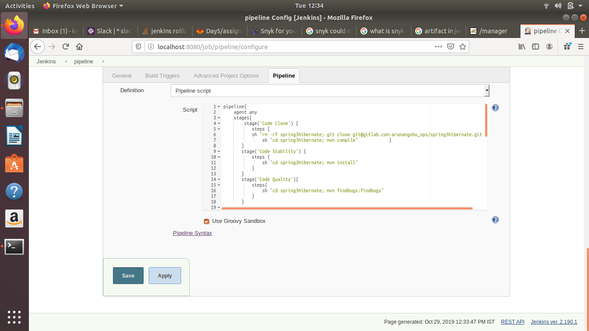
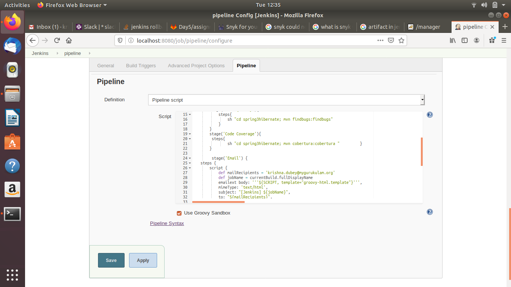
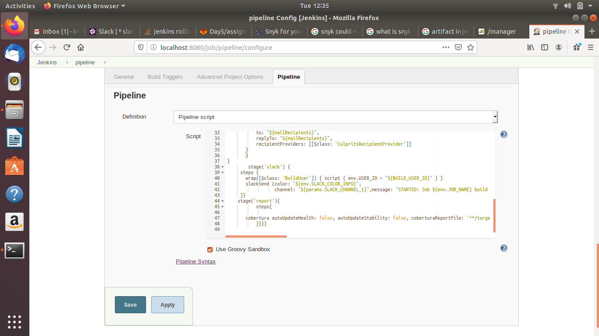
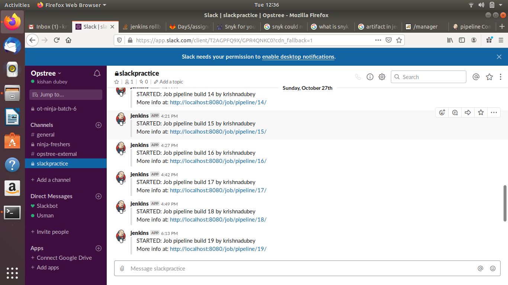
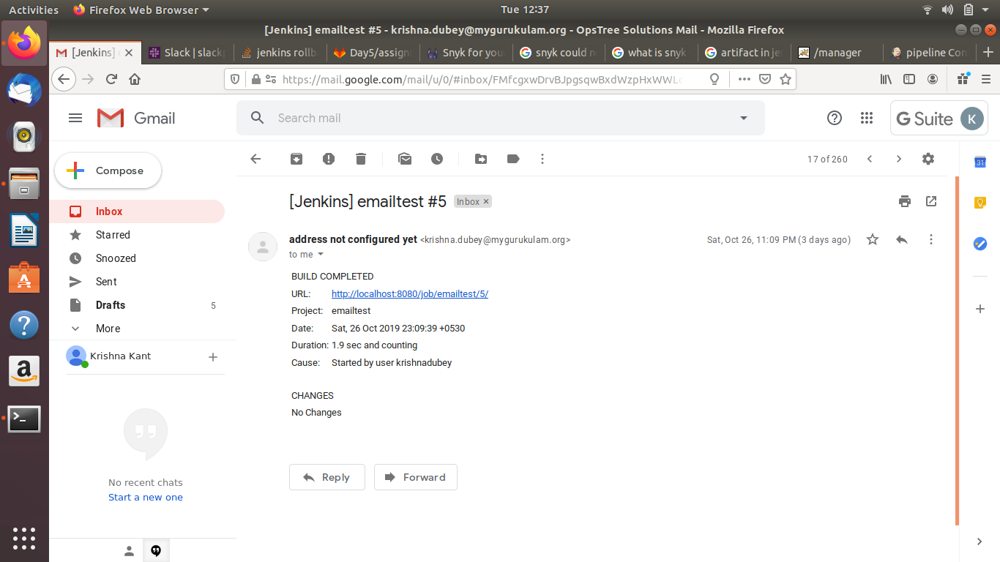
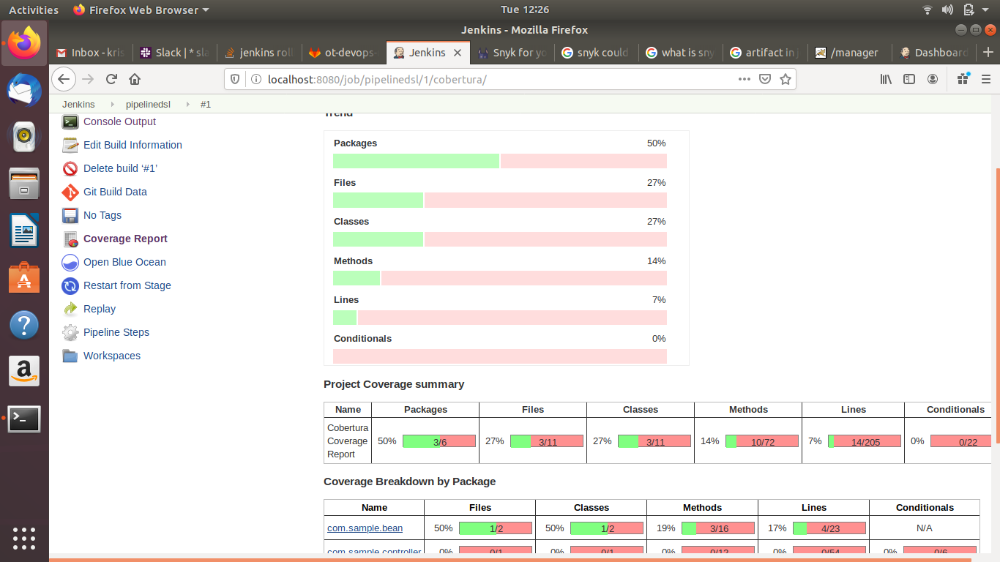
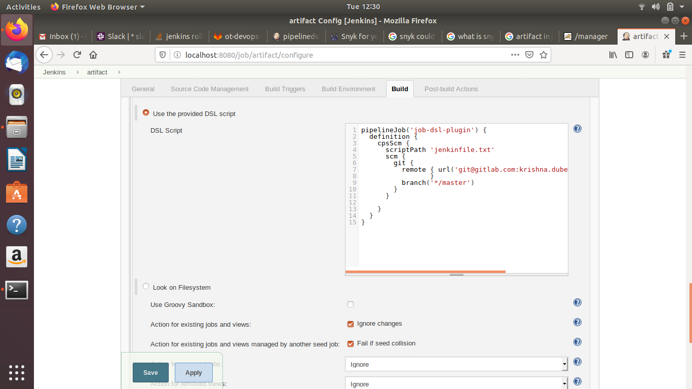
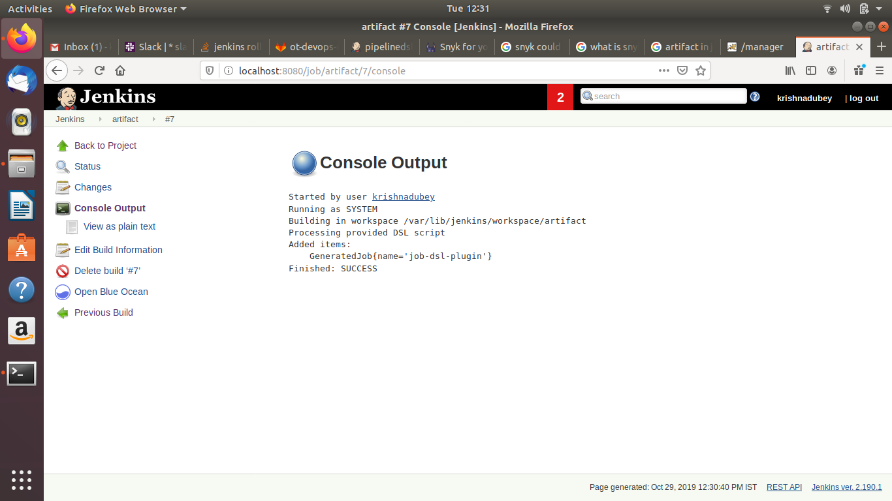
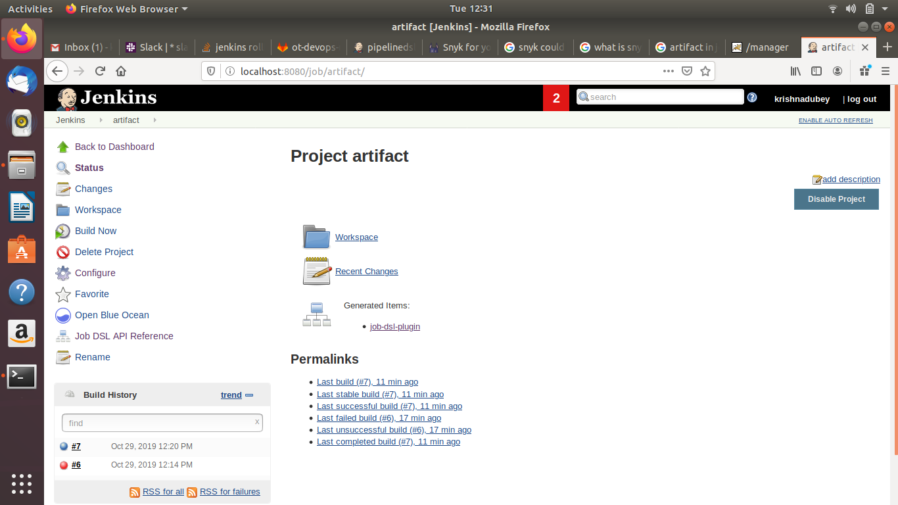

# Create a pipeline job for CI which will include below stages.

* Checkout code (Clone spring3hibernate)

* Code Stability

* Code Quality

* Code Coverage

* Email Notification (Notification must contains job console URL and the username who started the job)

* Slack Notification (Notification must contains job console URL and the username who started the job)

* Publish Code coverage and checkstyle report in above pipeline job.

* Create a Job DSL for above pipeline job and using Job DSL, create same pipeline job with different name.

