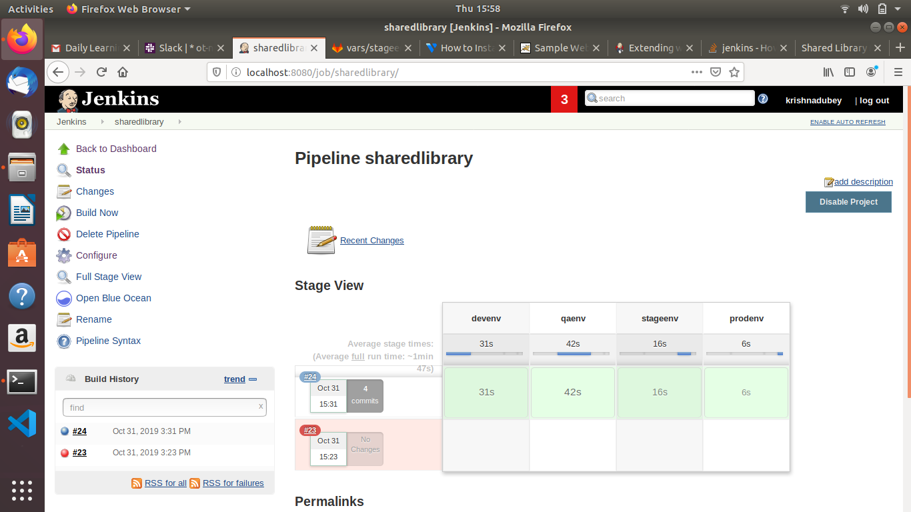

# Suppose there are three env:

* Dev (dev branch)

* QA (qa branch)

* Stage (stage branch)

* Prod (prod branch)

* Create CI-CD pipeline for all env(same stages like previous assignment) which will use common jenkins shared library instead of pipeline script to build and deploy Spring3Hibernate app.

