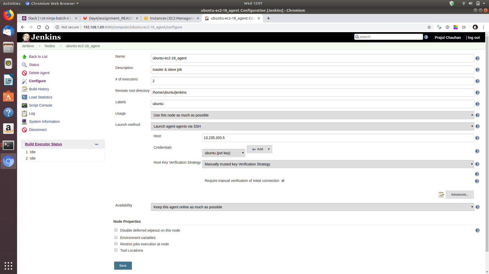
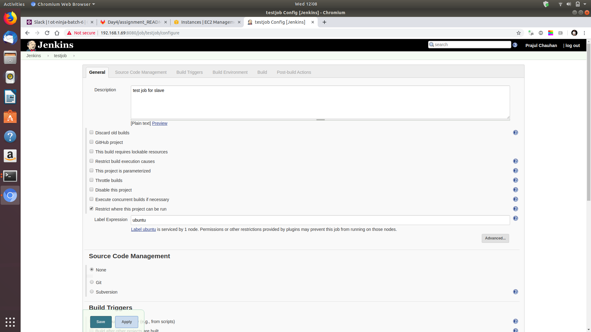
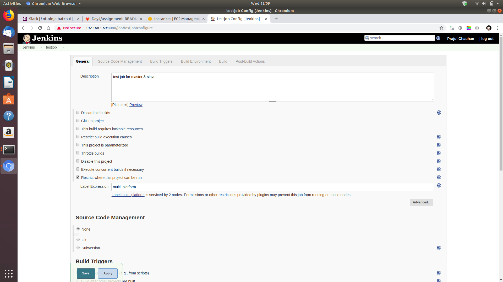
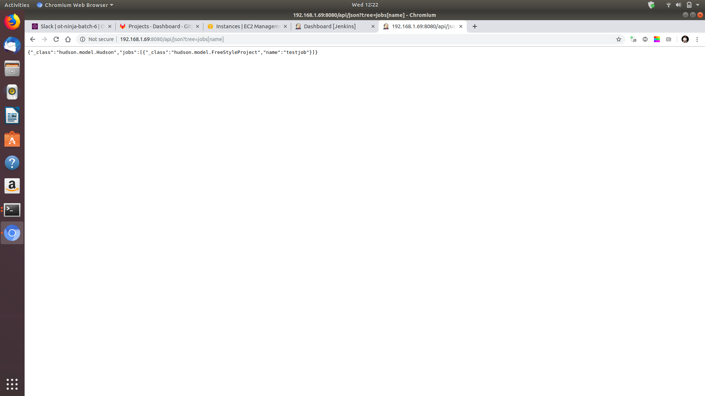
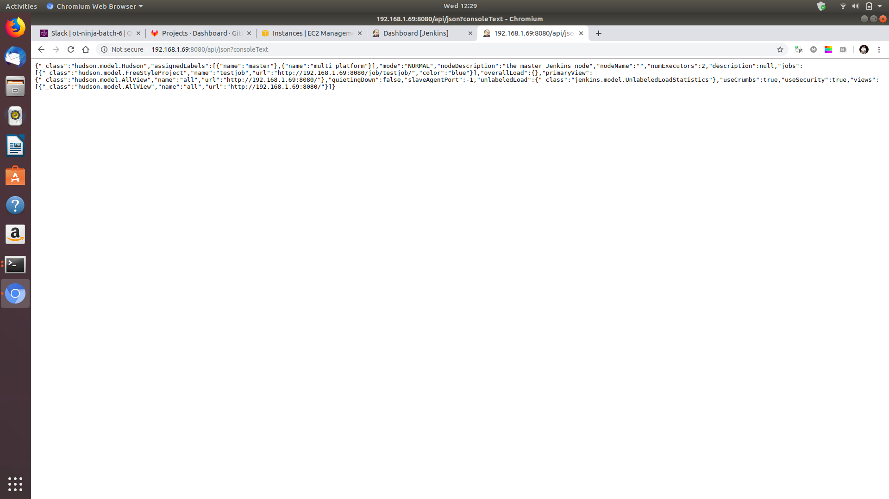
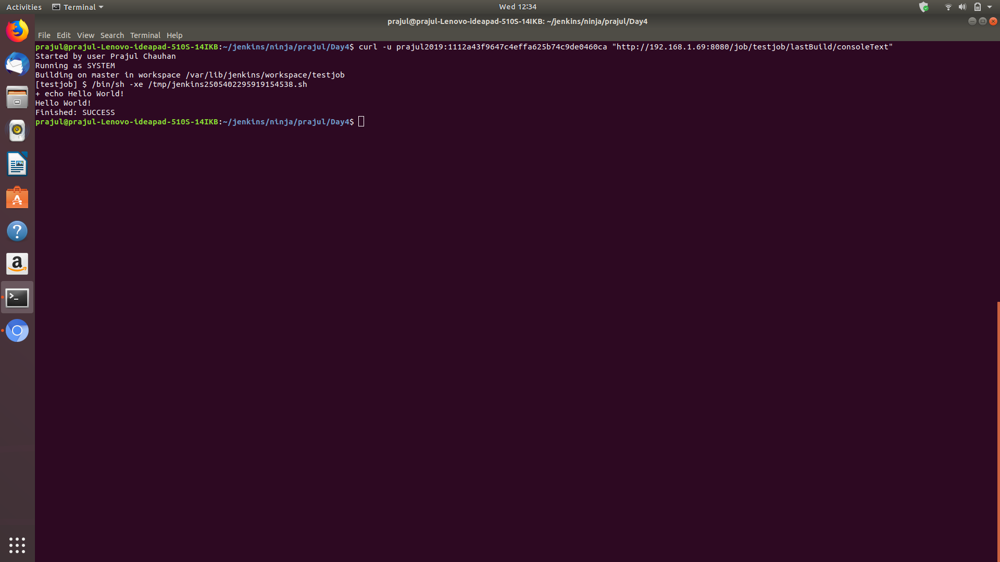
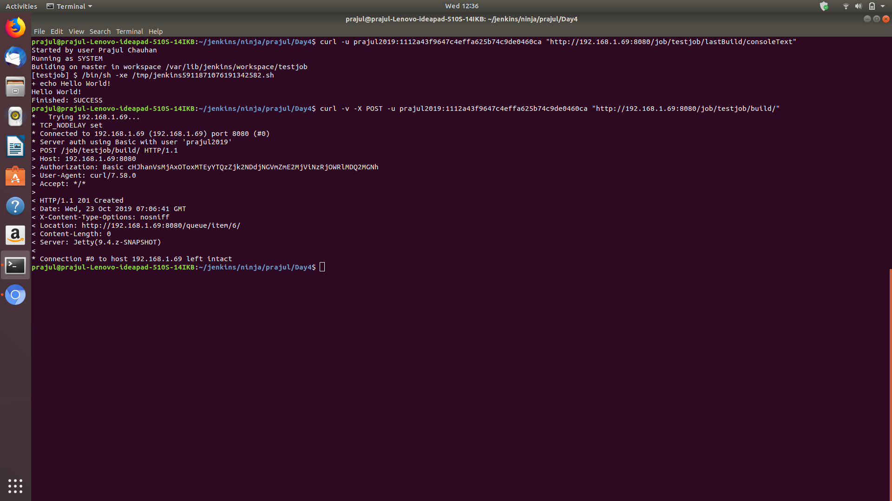

# Assignment Solution by Prajul Chauhan

### Must Do

# Assignment1: 
	

1. Create a jenkins slave and add it to jenkins master.
	

2. Restrict jobs for jenkins slave which you have created.

3. Create a job that can run on either on master or slave.

# Assignmnet2:
	

1. Use jenkins rest api to 

1. Get the list of all jobs 

2. Get the last build status

3. Get the console o/p of a job build. 

4. Trigger a jenkins job build

