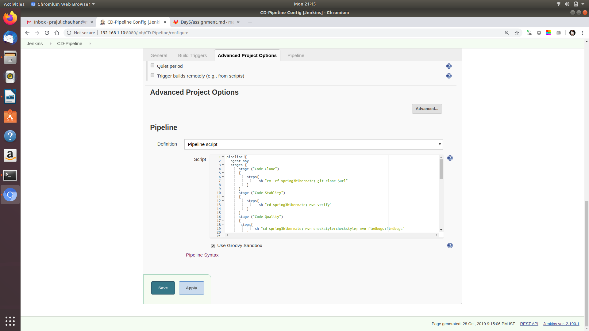
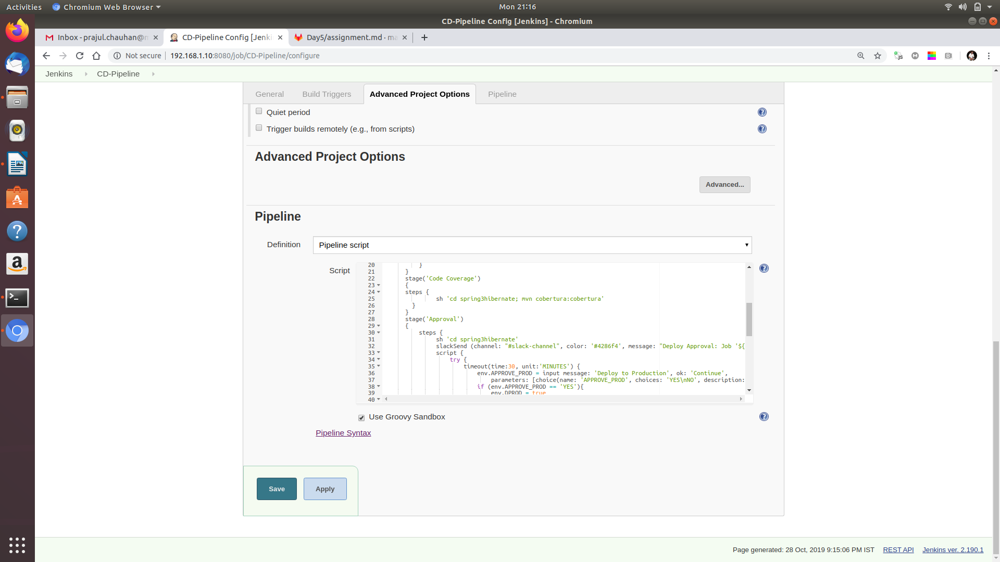
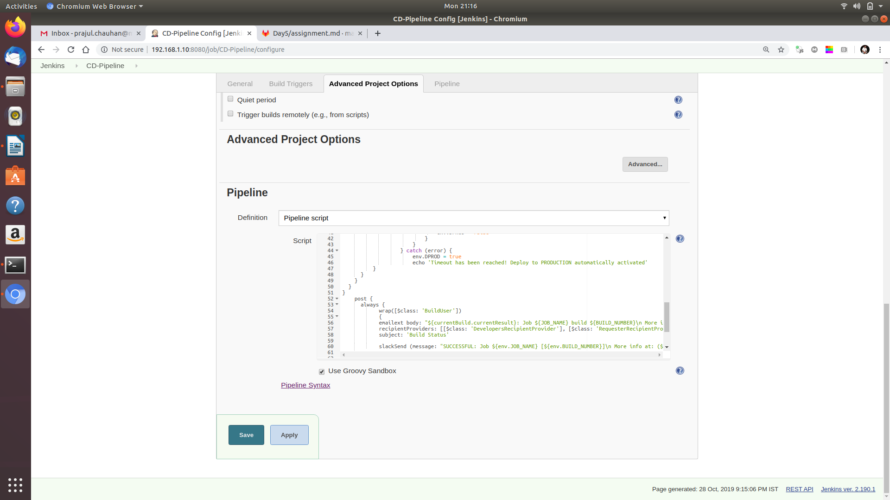
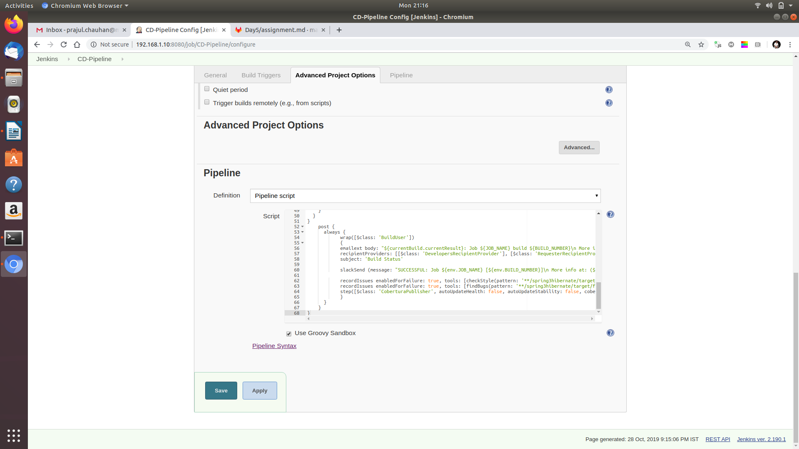
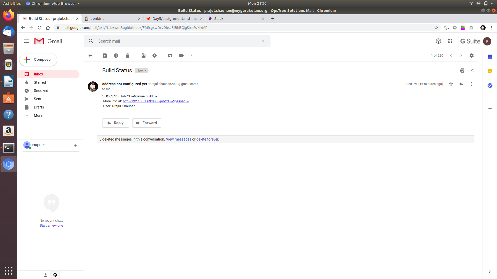
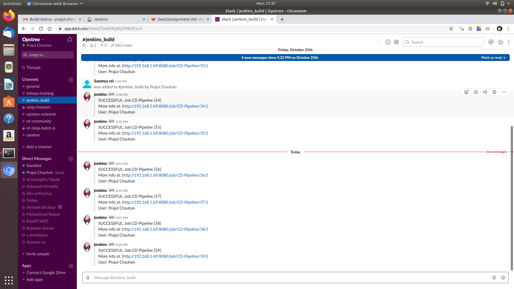
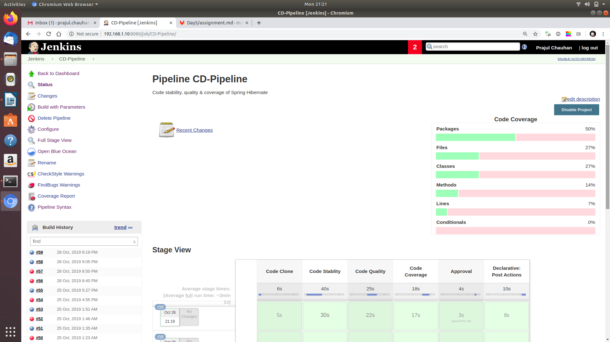
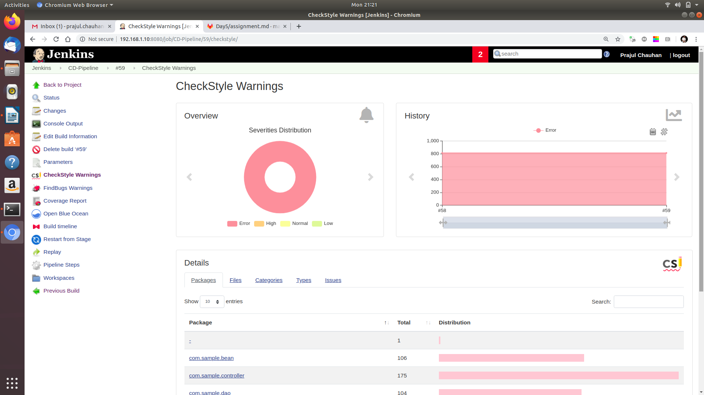
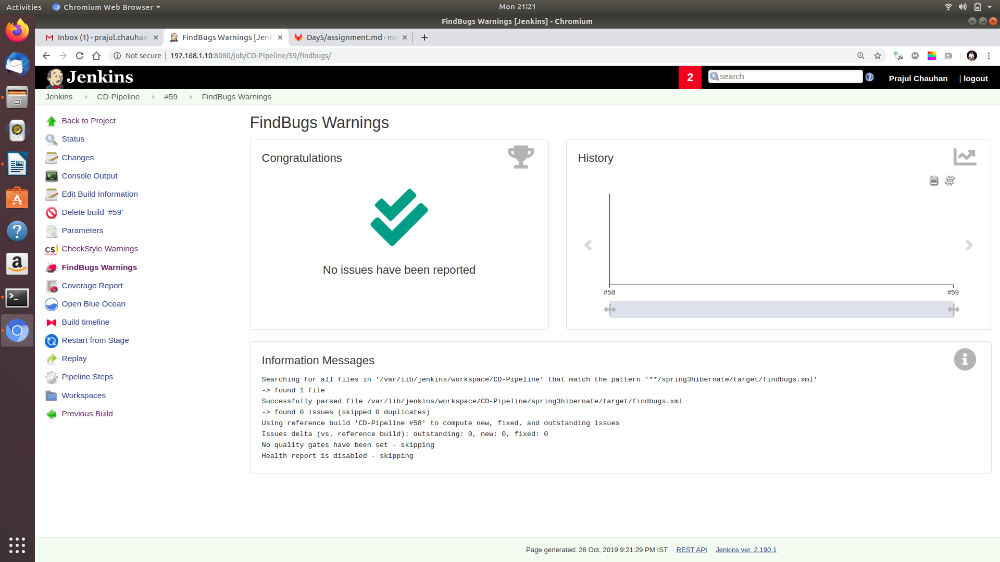
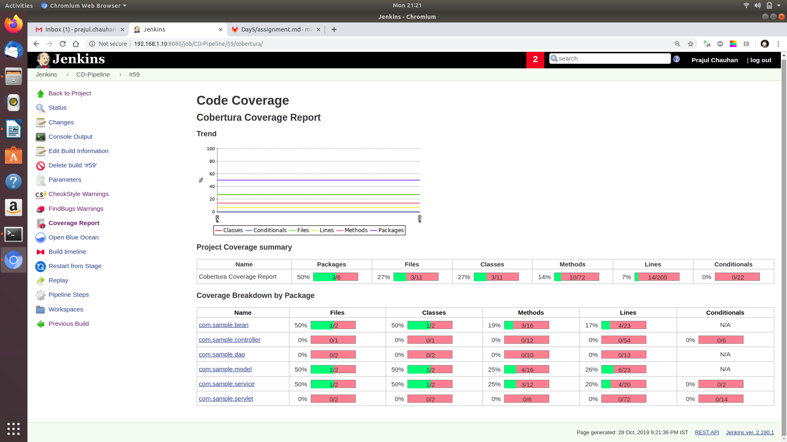

# Assignment Solution by Prajul Chauhan

## Create a pipeline job for CI which will include below stages.
  1. Checkout code (Clone spring3hibernate)

  2. Code Stability
 

  3. Code Quality
 

  4. Code Coverage

  5. Email Notification (Notification must contains job console URL and the username who started the job)

  6. Slack Notification (Notification must contains job console URL and the username who started the job)

# Publish Code coverage and checkstyle report in above pipeline job

* If issues in above health reports is greater than 2, then job should get failed.   
* Create a Job DSL for above pipeline job and using Job DSL, create same pipeline job with different name. 
